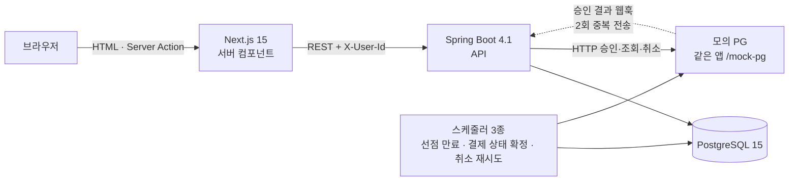
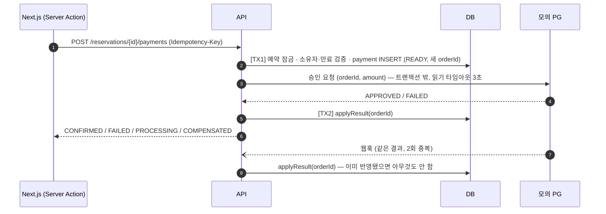

# STAYPOINT — 호텔 예약 핵심 흐름

ZIVO 채용 사전 과제. 가상의 호텔 예약 서비스 STAYPOINT 의 핵심 흐름 하나를 끝에서 끝까지 구현했다.

**배포**: https://global-alpha-phi.vercel.app (프론트, Vercel) · https://globalalpha-production.up.railway.app (API, Railway — [Swagger](https://globalalpha-production.up.railway.app/swagger-ui.html))

```
객실 검색 → 예약 생성(PENDING, 재고 선점 10분) → 모의 PG 결제 → 예약 확정(CONFIRMED) → 취소·환불(CANCELED)
```

이 저장소가 보여주려는 것은 기능 수가 아니라 다음 세 가지다.

1. **동시에 여러 사람이 마지막 객실을 예약해도 초과예약이 생기지 않는다** — 재고 3실에 50명 동시 요청 → 정확히 3명 성공 ([Q3](#q3-어떻게-증명했는가))
2. **결제와 예약이 어긋나지 않는다** — 중복 통지·연타·타임아웃은 한 번만 처리되고, "결제만 되고 확정 안 된" 상태는 자동 보상 취소되거나 운영자 확인 대상으로 드러난다 ([Q4](#q4-트랜잭션-경계와-멱등성))
3. **모든 선택에 이유가 있다** — 버린 대안과 "이 방식이 깨지는 조건" 까지 적었다

| 문서 | 내용 |
|---|---|
| [docs/01-planning.md](docs/01-planning.md) | 기획: 요구사항(FR/NFR), 정책(환불·상태), 시나리오 S1~S11 |
| [docs/02-design.md](docs/02-design.md) | 설계: ERD, API, 동시성·트랜잭션·멱등성 설계, Task 목록 |
| [docs/worklog.html](docs/worklog.html) | 작업 로그: 오류·설계 변경·결정 기록 (L001~) — 브라우저로 열기 |
| [docs/progress.html](docs/progress.html) | Task 별 진행·검증 결과 — 브라우저로 열기 |

---

## 목차

- [실행 방법](#실행-방법)
- [배포](#배포)
- [아키텍처](#아키텍처)
- [데이터 모델](#데이터-모델)
- [README 질문 8개](#readme-질문-8개)
  - [Q1. 왜 이 기술들을 골랐는가](#q1-왜-이-기술들을-골랐는가)
  - [Q2. 초과예약을 어떻게 막았는가](#q2-초과예약을-어떻게-막았는가)
  - [Q3. 어떻게 증명했는가](#q3-어떻게-증명했는가)
  - [Q4. 트랜잭션 경계와 멱등성](#q4-트랜잭션-경계와-멱등성)
  - [Q5. 프론트 서버/클라이언트 경계와 캐싱](#q5-프론트-서버클라이언트-경계와-캐싱)
  - [Q6. 재고 불일치 감지와 복구](#q6-재고-불일치-감지와-복구)
  - [Q7. 처음 써본 것과 익힌 방법](#q7-처음-써본-것과-익힌-방법)
  - [Q8. 시간이 더 있었다면](#q8-시간이-더-있었다면)
- [정책과 동작 정의](#정책과-동작-정의)
- [미구현 · 타협한 부분](#미구현--타협한-부분)
- [실제 투입 시간](#실제-투입-시간)

---

## 실행 방법

> 2026-10-09, 새 폴더에 `git clone` 한 뒤 아래 순서 그대로 실행해 확인했다: DB·백엔드·프론트 기동, 브라우저로 검색 → 예약 → 결제 확정, 백엔드 테스트 159건 통과, 프론트 lint·build 통과.

### 준비물

| 도구 | 버전 | 용도 |
|---|---|---|
| JDK | 17 | 백엔드 (Gradle Wrapper 포함, Gradle 설치 불필요) |
| Docker Desktop | 최신 | 로컬 PostgreSQL, 백엔드 테스트(Testcontainers). Windows 는 WSL2 필요 (`wsl --install --no-distribution` 후 재부팅) |
| Node.js | 20 이상 | 프론트엔드 |

### 1. DB (PostgreSQL 15)

```bash
cp .env.example .env          # DB 계정, 모의 PG 웹훅 비밀값. 로컬은 그대로 써도 된다
docker compose up -d          # staypoint-postgres 컨테이너 (5432)
```

### 2. 백엔드 (http://localhost:8080)

```bash
cd backend
./gradlew bootRun             # Windows PowerShell: .\gradlew bootRun
```

- 시작 시 Flyway 가 빈 DB 에 스키마(`db/migration`)와 데모 데이터(`db/seed`: 숙소 3 · 객실 타입 6 · 오늘부터 90일치 재고/요금, 금·토 +30%)를 적용한다. `.env` 의 `SPRING_PROFILES_ACTIVE=seed` 로 데모 데이터를 켠다.
- API 문서: http://localhost:8080/swagger-ui.html · 헬스 체크: http://localhost:8080/actuator/health

### 3. 프론트엔드 (http://localhost:3000)

```bash
cd frontend
cp .env.example .env.local    # BACKEND_URL=http://localhost:8080
npm ci
npm run dev                   # 또는 npm run build && npm start
```

### 4. 테스트

```bash
cd backend
./gradlew test                # Docker 실행 중이어야 한다 (Testcontainers 가 PostgreSQL 15 를 띄움)
```

```bash
cd frontend
npm run lint && npm run build # 타입 체크 포함
```

### 데모 시나리오

| 시나리오 | 방법 |
|---|---|
| 정상 흐름 | `/` → 숙소 → 날짜·인원 검색 → 예약하기 → 이름·연락처 → 결제하기 → "예약 확정" |
| 결제 거절 후 재결제 | 결제 화면 "실패율 100%" 로 결제 → 거절 → "0%" 로 다시 결제 → 확정 |
| PG 타임아웃 | "응답 지연 5초" (백엔드 PG 읽기 타임아웃 3초) → 처리 중 → 웹훅/재조회로 확정 |
| 마지막 1실 경쟁 | "스테이포인트 제주 애월 / 독채 풀빌라" 는 재고 1실. 두 사용자 ID 로 같은 날짜 예약 → 한 명만 성공 |
| 취소·환불 | 상단 "내 예약" → 상세 → 지금 취소 시 환불 예정액 확인 → 예약 취소 |
| 선점 만료 | 결제하지 않고 10분 경과 → 스케줄러가 CANCELED(HOLD_EXPIRED) + 재고 복원 |
| 관리자 | 상단 "관리자" → 예약 목록 필터·페이지 / 재고·요금 기간 수정 / 확인 필요(자동 환불 실패·재고 불일치) |

- 사용자 식별은 인증 대신 상단 "사용자 ID" 입력값을 쿠키에 두고 백엔드에 `X-User-Id` 헤더로 보낸다 (과제 명시).
- 모의 PG 장애는 결제 화면의 선택값 또는 설정으로 주입한다: `mockpg.approve.fail-rate`, `mockpg.approve.delay-ms`, `mockpg.cancel.fail-rate` ([application.yml](backend/src/main/resources/application.yml)). 예: `./gradlew bootRun --args='--mockpg.cancel.fail-rate=1.0'` 로 환불이 계속 실패하는 상황 → 5회 후 관리자 "확인 필요" 에 노출.

---

## 배포

| | 주소 |
|---|---|
| **서비스 (프론트)** | https://global-alpha-phi.vercel.app |
| 백엔드 API | https://globalalpha-production.up.railway.app — [헬스 체크](https://globalalpha-production.up.railway.app/actuator/health) · [Swagger](https://globalalpha-production.up.railway.app/swagger-ui.html) |

배포 후 확인 (2026-10-09): 배포 주소에서 실제 브라우저로 검색 → 예약(폼 이중 제출 → 1건) → 결제 확정, 거절 후 새 키로 재결제, PG 지연 5초 → 확정, 내 예약 → 취소 → 100% 환불 완료·잔여 재고 복원. 재고 불일치·운영자 확인 대상 0건. 확인용 예약은 모두 취소해 두었다.

### 배포하며 막혔던 지점과 해결

| 증상 | 원인 | 해결 |
|---|---|---|
| Railway 첫 배포 실패, 알림 메일의 링크는 "404 Looks like you are lost" | 저장소를 연결하는 순간 첫 배포가 시작되는데, 그때는 아직 DB 와 환경변수가 없어 앱이 `localhost:5432` 로 접속하다 종료. 메일 링크 404 는 원인과 무관(대시보드에서 직접 확인) | DB 추가·변수 입력 후 재배포. 대시보드의 Deploy Logs 가 실제 원인을 보는 곳 |
| 변수를 넣었는데도 **CRASHED**, 로그 첫 줄은 `Picked up JAVA_TOOL_OPTIONS` 뿐 | (오판) 메모리 부족으로 의심 → 로컬에서 `docker run --memory=512m` 으로 재현해 보니 약 300MB 로 정상 기동 → 메모리는 원인 아님. 로그를 더 내려 보니 `Driver org.postgresql.Driver claims to not accept jdbcUrl, jdbc:postgresql://{{Postgres.PGHOST}}…` | Railway 참조 변수를 **`$` 없이** `{{Postgres.PGHOST}}` 로 입력해 치환되지 않고 글자 그대로 전달됨 → `${{Postgres.PGHOST}}` 로 다시 입력. 아래 배포 순서에 주의 문구 추가 |
| 배포 준비 중 발견: Linux 에서 `./gradlew` 실패 가능 | `backend/gradlew` 가 Windows 에서 실행 권한 없이(100644) 커밋됨 | `git update-index --chmod=+x`, Dockerfile 에서도 `chmod +x` |
| Railway PostgreSQL 이 **18.6** (로컬·테스트는 15) | Railway 가 새 DB 를 최신 버전으로 생성 | 이 설계가 쓰는 기능(행 잠금, CHECK, 부분 UNIQUE, `ON CONFLICT`, `SKIP LOCKED`)은 15·18 공통. 테스트 이미지를 `postgres:18-alpine` 으로 바꿔 **백엔드 테스트 159건 전부 통과**(동시 예약 3/47 동일) 확인 후 15 로 되돌림 |

Vercel 은 Root Directory(`frontend`)와 `BACKEND_URL` 만 지정해 한 번에 배포됐다.

### 구성

```
Vercel (frontend/) ──BACKEND_URL──▶ Railway 백엔드 서비스 (backend/Dockerfile) ──▶ Railway PostgreSQL
```

- 백엔드 이미지: [backend/Dockerfile](backend/Dockerfile) — 멀티 스테이지(Gradle 빌드 → JRE 17). **빌드 컨텍스트는 저장소 루트**(`docker build -f backend/Dockerfile .`) — 빌드가 `db/migration`·`db/seed` 를 jar 에 넣기 때문. Railway 설정은 [railway.toml](railway.toml) (Dockerfile 경로, 헬스 체크 `/actuator/health`).
- 스키마·데모 데이터는 백엔드가 시작할 때 Flyway 가 빈 DB 에 적용한다 (별도 DB 작업 없음).
- 모의 PG 는 같은 컨테이너 안에서 `http://localhost:${PORT}/mock-pg` 로 호출된다 (포트는 플랫폼이 `PORT` 로 줌).

### 배포 순서 (재현용)

1. **Railway** — New Project → Deploy from GitHub repo → 이 저장소 (`railway.toml` 이 Dockerfile 빌드를 지정)
2. 같은 프로젝트에 **+ New → Database → PostgreSQL** 추가
3. 백엔드 서비스 **Variables** → **Raw Editor** 에 붙여 넣기 (`${{Postgres.…}}` 는 Railway 참조 변수 문법 — **`$` 를 빠뜨리면 치환되지 않고 글자 그대로 전달된다**. `Postgres` 는 DB 서비스 카드의 이름):

   | 변수 | 값 |
   |---|---|
   | `DB_URL` | `jdbc:postgresql://${{Postgres.PGHOST}}:${{Postgres.PGPORT}}/${{Postgres.PGDATABASE}}` |
   | `DB_USERNAME` | `${{Postgres.PGUSER}}` |
   | `DB_PASSWORD` | `${{Postgres.PGPASSWORD}}` |
   | `SPRING_PROFILES_ACTIVE` | `seed` (데모 데이터) |
   | `MOCKPG_WEBHOOK_SECRET` | 무작위 문자열 (예: `openssl rand -hex 24`) |

4. 백엔드 서비스 **Settings → Networking → Generate Domain** → `https://….up.railway.app/actuator/health` 가 `UP` 인지 확인
5. **Vercel** — Add New Project → 이 저장소 → **Root Directory = `frontend`** → Environment Variable `BACKEND_URL` = 4번의 백엔드 주소 (끝에 `/` 없이) → Deploy

| 대상 | 배포처 | 고른 이유 | 버린 대안 |
|---|---|---|---|
| 백엔드 + PostgreSQL | Railway | 같은 프로젝트 안에서 DB 연결 변수를 백엔드 환경변수로 바로 참조 → 설정이 가장 단순. Dockerfile 로 배포 | Render + Neon — 무료 유지에는 더 안정적이지만 서비스 두 곳을 연결하는 설정이 늘어남 |
| 프론트 | Vercel | Next.js 제작사, 설정 없이 App Router·Server Action 동작 | Railway 에 함께 — 가능하지만 Next 빌드·캐시 설정을 직접 해야 함 |

- 리스크: Railway 무료 크레딧이 평가 기간 중 소진될 수 있음 → 인터뷰 전 확인, 필요하면 같은 Dockerfile 로 Render 이전.

---

## 아키텍처



- **브라우저는 백엔드를 직접 부르지 않는다.** 조회는 Next 서버 컴포넌트, 변경은 Server Action 이 서버에서 백엔드를 호출 → CORS 불필요, 백엔드 주소가 브라우저에 노출되지 않음.
- **모의 PG 는 같은 Spring 앱 안에 있지만 반드시 HTTP 로 호출한다** — 지연·타임아웃·5xx 가 실제 외부 PG 처럼 네트워크 너머에서 일어나게 하기 위해서. 자기 테이블(`mockpg_*`)만 쓰고 결제 패키지와 코드 의존이 없다.
- 스케줄러는 `FOR UPDATE SKIP LOCKED` 로 작업을 나눠 가져 서버를 여러 대 띄워도 같은 작업을 두 번 처리하지 않는다.

### 백엔드 패키지

```
backend/src/main/java/com/staypoint/
├── common/        에러 응답 형식, Clock(Asia/Seoul), 설정, 스케줄링 on/off
├── property/      숙소·객실 조회, 가용 객실 검색
├── inventory/     날짜별 재고·요금 — 재고 차감/복원 조건부 UPDATE 가 여기
├── reservation/   예약 생성(멱등), 상태 전이, 선점 만료 스케줄러
├── payment/       결제(트랜잭션 밖 PG 호출), 결과 반영(멱등), 보상 취소, 상태 확정·취소 재시도 스케줄러, PG 클라이언트
├── cancellation/  예약 취소·환불, RefundPolicy
├── mypage/        내 예약 목록·상세(환불 예정액) — 조회 전용
├── mockpg/        모의 PG (승인·조회·취소, 장애 주입, 웹훅)
└── admin/         관리자 API (예약 목록, 재고·요금, 확인 대상, 재고 정합 점검·재계산)
```

의존 방향은 한쪽으로만: `cancellation → reservation·payment`, `payment → reservation`, `mypage → 전부(조회)`. 취소·내 예약을 `reservation` 에 두면 `reservation ↔ payment` 순환이 생겨 분리했다 (작업 로그 L033·L035).

### 프론트 라우트

| 경로 | 내용 |
|---|---|
| `/?region&checkIn&checkOut&guests` | 숙소 목록 — 날짜·인원으로 검색, 숙소마다 예약 가능한 객실(타입·잔여·총액), 빈 객실이 없는 숙소는 숨김 (T17) |
| `/properties/[id]?checkIn&checkOut&guests` | 숙소 상세 + 가용 객실(날짜별 요금·총액·잔여) |
| `/reservations/new` | 예약자 정보 입력 |
| `/reservations/[id]/pay` | 결제 (데모용 실패율·지연 선택) |
| `/me/reservations`, `/me/reservations/[id]` | 내 예약 목록·상세, 환불 예정액, 취소 |
| `/admin/reservations` · `/admin/inventory` · `/admin/issues` | 예약 목록(필터·페이지) · 재고·요금 · 확인 필요 |

---

## 데이터 모델

스키마의 단일 출처는 [db/migration/V1__init_schema.sql](db/migration/V1__init_schema.sql). 정합성은 애플리케이션 코드만 믿지 않고 **DB 제약으로도** 보장한다.

| 테이블 | 핵심 컬럼 | 정합성을 지키는 제약 |
|---|---|---|
| `property`, `room_type` | 숙소, 객실 타입(정원) | FK, `capacity > 0` |
| `room_inventory` | `room_type_id, stay_date, total_count, booked_count` | **UNIQUE(room_type_id, stay_date)**, **CHECK(0 ≤ booked_count ≤ total_count)** ← 초과예약 최종 방어선 |
| `room_rate` | `room_type_id, stay_date, price NUMERIC(12,0)` | UNIQUE(room_type_id, stay_date), CHECK(price ≥ 0) — 날짜별 요금으로 주말·성수기 표현 |
| `reservation` | 상태, 체크인/아웃, **확정 총액**, 선점 만료 시각, 환불액, 멱등 키 | **UNIQUE(user_id, idempotency_key)** ← 예약 연타, CHECK(check_out > check_in), CHECK(status IN …) |
| `reservation_history` | from → to, 사유, 주체(actor), 시각 | 모든 상태 전이를 기록 |
| `payment` | `pg_order_id, pg_tid, amount, canceled_amount, status, idempotency_key` | **UNIQUE(idempotency_key)** ← 결제 연타, **UNIQUE(pg_order_id)** ← 중복 통지, **부분 UNIQUE(reservation_id) WHERE status IN (READY, APPROVED)** ← 다른 키로 동시 결제, CHECK(canceled ≤ amount) |
| `payment_cancel` | `cancel_amount, reason, status, cancel_key, attempt_count, last_error, next_retry_at` | **UNIQUE(cancel_key)** ← PG 취소 멱등. 이 테이블이 재시도 작업 큐(아웃박스) |
| `mockpg_payment`, `mockpg_cancel` | 모의 PG 전용 | UNIQUE(order_id), UNIQUE(cancel_key) ← PG 쪽 멱등 |

- **숙박일**: `stay_date` 는 체크인 ~ 체크아웃 **전날**. 1박 2일 = 재고 행 1개.
- **금액**: Java `BigDecimal`, DB `NUMERIC(12,0)`, KRW 원 단위. 환불 금액만 계산이 있고 반올림 규칙(원 단위 내림)은 `RefundPolicy` 한 곳에 있다.
- **시간**: DB `timestamptz` / `date`, 코드는 주입된 `Clock`(Asia/Seoul) 사용 → 환불율·만료 계산을 테스트에서 시간 고정 가능.
- **예약 상태**: `PENDING → CONFIRMED → COMPLETED`, `PENDING → CANCELED`(사용자 취소·선점 만료), `CONFIRMED → CANCELED`. 선점 만료는 별도 상태 없이 `CANCELED + cancel_reason=HOLD_EXPIRED`. 전이는 엔티티 메서드로만, 허용되지 않은 전이는 예외.

---

## README 질문 8개

### Q1. 왜 이 기술들을 골랐는가

| 영역 | 선택 | 이유 | 버린 대안 |
|---|---|---|---|
| 프론트 | **Next.js 15.5 (App Router) + TypeScript** | 과제 고정. App Router 는 서버/클라이언트 경계를 컴포넌트 단위로 정할 수 있어 "무엇을 어디서 실행하고 무엇을 캐시하는가" 를 코드로 보여주기 좋다. 15 는 `fetch` 기본값이 "캐시 안 함" 이라 실시간 재고에 안전하고 자료가 가장 많다 | Pages Router — 구버전 방식 / Next 16 — 캐싱 모델이 새로 바뀌어 자료가 적음 |
| 데이터 패칭 | **서버 컴포넌트 `fetch` + Server Action**, 라이브러리 없음 | 조회·변경이 모두 서버에서 일어나 CORS 가 필요 없고 백엔드 주소·사용자 헤더가 브라우저에 노출되지 않는다 | TanStack Query / SWR — 클라이언트 캐시가 하나 더 생겨 무효화를 설명할 대상이 늘어남. 상태관리 라이브러리도 넣지 않음 |
| 백엔드 | **Java 17 + Spring Boot 4.1.1 + Gradle** | 과제 고정이자 유일하게 써본 기술. 처음엔 3.5 로 설계했으나 오픈소스 지원 종료로 Initializr 가 제공하지 않아 4.1.1 로 변경 (L020·L021) | Java 21 — 가상 스레드 등 이점을 이 과제에서 쓰지 않음 / Kotlin — 학습 부담 |
| DB 접근 | **Spring Data JPA** (엔티티·상태 전이) + **네이티브 SQL** (재고 차감·잠금) + **JdbcTemplate** (집계·동적 조회) | 상태 전이는 엔티티 메서드로 규칙을 강제하기 좋다. 반면 동시성 핵심인 재고 차감은 **SQL 한 줄이 눈에 보이게** 직접 작성. 가용 검색(재고·요금 JOIN + HAVING), 관리자 동적 필터, 모의 PG(`ON CONFLICT`) 는 엔티티로 표현하기 어려운 집계·조건이라 SQL 로 | MyBatis — 모든 SQL 을 직접 작성해 코드량 증가 / JPA 만 — 재고 차감이 엔티티 수정 뒤에 숨어 경합 동작을 설명하기 어려움 |
| DB | **PostgreSQL 15** (운영 버전과 동일) | 행 잠금, CHECK, **부분 UNIQUE 인덱스**, `ON CONFLICT`, `FOR UPDATE SKIP LOCKED` — 이 설계가 쓰는 기능이 모두 있다 | MySQL — 부분 인덱스 미지원 |
| 마이그레이션 | **Flyway** (`db/migration/V1__…sql`) | 순수 SQL 이라 DDL 이 그대로 보이고, 빈 DB 에서 스키마가 재현된다. 데모 데이터는 repeatable(`R__`) + `seed` 프로파일 | Liquibase — XML/YAML 문법 학습 |
| 테스트 | **JUnit 5 + Testcontainers(PostgreSQL 15)** | 동시성 테스트는 운영과 같은 DB 엔진에서 돌려야 의미가 있다 | H2 — 락·제약 동작이 PostgreSQL 과 다름 |
| 로컬 DB | **Docker Desktop + docker compose** | 명령 한 줄로 같은 DB, 평가자 재현이 쉬움 | PostgreSQL 직접 설치 — 환경마다 다름 |
| 배포 | Railway + Vercel | [배포](#배포) 참고 | Render + Neon |
| 추가 의존성 | springdoc-openapi (API 문서), Actuator (헬스 체크), `server-only` (프론트) | 각각 의존성 1개로 과제 권장 사항 해결. `server-only` 는 서버 전용 코드(백엔드 주소)가 실수로 브라우저 번들에 섞이면 **빌드가 실패**하게 한다 | — |

**의도적으로 넣지 않은 것**: Lombok(코드가 숨겨져 설명이 어려움 → `record` 사용), Redis·분산락·메시지 큐(DB 하나로 정합성을 지킬 수 있는데 인프라를 늘리면 DB 와 이중 관리 문제가 생김), 인증 라이브러리(과제 범위 밖), E2E 테스트 프레임워크(아래 Q8).

### Q2. 초과예약을 어떻게 막았는가

**선택: 조건부 UPDATE 한 문장 + CHECK 제약** ([RoomInventoryRepository](backend/src/main/java/com/staypoint/inventory/RoomInventoryRepository.java))

```sql
UPDATE room_inventory
   SET booked_count = booked_count + 1, updated_at = now()
 WHERE room_type_id = :roomTypeId
   AND stay_date >= :checkIn AND stay_date < :checkOut
   AND booked_count < total_count;
```

- 예약 생성 트랜잭션: `reservation INSERT` → 위 UPDATE → `reservation_history INSERT`. **영향받은 행 수 ≠ 숙박일 수** 면(하루라도 매진이거나 재고 행 없음) 예외 → 트랜잭션 전체 롤백 → 일부 날짜만 차감되는 일 없음.
- 동작 원리: PostgreSQL 은 UPDATE 대상 행에 행 잠금을 건다. 같은 날짜를 노리는 두 트랜잭션 중 하나는 기다리고, 앞 트랜잭션이 커밋되면 **WHERE 조건을 최신 값으로 다시 평가**한다(READ COMMITTED). 마지막 1실이면 두 번째는 `booked_count < total_count` 가 거짓 → 0행 → `SOLD_OUT`.
- 최종 방어선: `CHECK (booked_count <= total_count)`. 코드에 버그가 있어 조건 없이 +1 해도 DB 가 거부한다 (테스트로 확인).
- 예약 INSERT 를 재고 UPDATE 보다 **먼저** 하는 이유: 같은 멱등 키의 중복 요청은 UNIQUE 인덱스에서 먼저 막혀 재고 행 잠금까지 가지 않는다.

| 방식 | 판단 | 이유 |
|---|---|---|
| **조건부 UPDATE (선택)** | ✅ | 검사와 차감이 한 문장이라 사이에 끼어들 틈이 없다. 재시도 로직 불필요, 쿼리가 짧아 설명이 쉽다 |
| 비관적 락 (`SELECT … FOR UPDATE` → UPDATE) | 차선 | 정확하지만 2단계라 잠금 보유 시간이 길고 코드가 늘어난다. 같은 효과를 한 문장으로 얻을 수 있다 |
| 낙관적 락 (`@Version`) | ✗ | 마지막 객실처럼 경합이 심한 곳에서는 대부분 충돌 → 재시도 폭주, 재시도 횟수·백오프 설계가 추가로 필요 |
| 객실 단위 행 + UNIQUE | ✗ | 객실 수만큼 행을 만들어 빈 슬롯을 찾아야 하고 관리자 재고 수정이 복잡해진다 |
| 분산락 (Redis 등) | ✗ | DB 하나로 충분한데 인프라 추가, 락 만료와 DB 상태의 이중 관리 문제 |
| `UNIQUE(room_type_id, stay_date)` 만 | ✗ | 행 중복만 막을 뿐 `booked_count` 증가는 막지 못한다 |

**`booked_count` 카운터 vs 매번 예약 집계**: 카운터를 골랐다. 집계 방식은 "집계 → 판단 → 삽입" 사이에 다른 트랜잭션이 끼어들 수 있어 결국 별도 락이 필요하다. 대신 카운터는 예약 테이블과 어긋날 수 있어 정합 점검으로 보완한다 ([Q6](#q6-재고-불일치-감지와-복구)).

**같은 행을 건드리는 다른 흐름도 같은 규칙을 따른다**

- 선점 만료·취소: 예약 행을 잠그고(`FOR UPDATE`) 상태를 바꾼 **같은 트랜잭션에서** `booked_count - 1` (조건 `booked_count > 0`).
- 만료와 결제 확정이 동시에 오면: 둘 다 예약 행을 먼저 잠그므로 순서가 강제된다. 만료가 먼저면 결제 반영 시 예약이 PENDING 이 아니라 확정하지 않고 **보상 취소**, 결제가 먼저면 CONFIRMED 라 만료 대상이 아니다 (테스트 S7).
- 관리자 재고 축소: 기간 재고 행을 날짜 순으로 `FOR UPDATE` → 예약 수보다 줄이는 날짜가 있으면 전체 거부. 그 사이 예약 요청은 잠금을 기다렸다가 새 `total_count` 로 다시 평가된다 (테스트: 재고 축소와 10명 동시 예약 3회 반복, 항상 booked ≤ total).
- 잠금 순서는 모든 흐름에서 `reservation → payment → room_inventory` (교착 방지).

**이 방식이 깨지는 조건**

1. `booked_count` 를 이 쿼리 밖의 경로(수동 SQL, 버그)로 바꾸면 예약 테이블과 어긋난다 — 초과예약 자체는 CHECK 가 막지만 "재고가 남았는데 못 파는" 상태가 생길 수 있다 → Q6 의 감지·재계산.
2. 재고 행이 (객실 타입, 날짜) 당 하나라는 전제(UNIQUE 가 보장). 재고를 여러 DB·샤드에 나누면 단일 행 잠금 전제가 깨진다.
3. **극단적 경합**(같은 날짜에 수천 건 동시): 정확성은 유지되지만 같은 행 잠금을 순서대로 기다리며 대기 트랜잭션이 DB 커넥션을 쥐고 있어 커넥션 풀(기본 10)이 고갈될 수 있다. 현재는 커넥션 획득 타임아웃 3초로 빨리 실패시키는 정도이고, `lock_timeout`·앞단 대기열은 넣지 않았다 (Q8).
4. 여러 날짜 행을 한 문장으로 잠글 때 PostgreSQL 이 실행 계획에 따라 행 순서를 바꾸면 이론상 교착이 가능하다 → PostgreSQL 이 감지해 한쪽을 실패시키므로 **초과예약은 생기지 않고** 그 요청만 실패한다.

### Q3. 어떻게 증명했는가

**동시성 테스트** — [ReservationConcurrencyTest](backend/src/test/java/com/staypoint/reservation/ReservationConcurrencyTest.java), Testcontainers 의 실제 PostgreSQL 15

- 재고 3실(2박이라 재고 행 2개를 동시에 차감)에 서로 다른 사용자 50명이 동시에 예약. `CountDownLatch` 로 50개 스레드를 붙잡아 두었다가 한 번에 출발시킨다.
- 검증: 성공 정확히 3, 나머지 47은 모두 `SOLD_OUT`(그 외 오류 0), 두 날짜 모두 `booked_count == 3`, 예약 3건, 이력 3건.

실제 실행 결과 (`./gradlew test`, 2026-10-09):

```
[동시 예약] 재고=3, 요청=50 → 성공=3, SOLD_OUT=47, 기타 오류=0, booked_count(2026-10-19)=3, booked_count(2026-10-20)=3
ReservationConcurrencyTest > 재고_3실에_50명이_동시에_예약하면_정확히_3명만_성공한다() PASSED (0.357s)
```

개발 중 4회 연속 실행해 매번 같은 결과였다.

**그 밖의 정합성 테스트** — 백엔드 테스트 159건, 전부 통과

| 테스트 | 검증 |
|---|---|
| 같은 멱등 키 동시 2회 | 예약 1건, 재고 1회 차감, 두 요청 모두 같은 예약을 받음 |
| 다박 중 하루 매진 (S3) | 예약 실패, 다른 날짜 재고 변화 없음 |
| 스키마 제약 | 조건 없이 +1 하는 "버그 코드" 를 흉내 내도 CHECK 가 거부, 음수 방지, 멱등 키·부분 UNIQUE |
| 선점 만료 스케줄러 3개 동시 | 만료 대상 5건이 각각 한 번만 처리 (SKIP LOCKED) |
| 결제 S4~S7 | 만료 예약 결제 거부 / 승인 통지 3회 동시 → 확정 1회 / 다른 키 연타 → 승인 1건 / 승인 대기 중 만료 → 보상 취소 |
| 타임아웃 | PG 응답 지연 > 타임아웃 → PROCESSING → 상태 확정 스케줄러가 PG 조회로 확정, 같은 키 재시도해도 PG 승인 1건 |
| **환불 금액 경계값 (S10)** | D = 8·7·6·3·2·1·0·−1 → 100·100·70·70·50·50·0·0%, 99,999원 × 70% = 69,999원(내림) — [RefundPolicyTest](backend/src/test/java/com/staypoint/cancellation/RefundPolicyTest.java) |
| 재취소·동시 3회 취소 (S9) | 같은 응답, 재고·환불·이력 1회 |
| 결제 취소 재시도 (S8) | 아래 출력 — 5회 후 MANUAL_REVIEW, 6번째 시도 없음 / 스케줄러 3개 동시 → 각 건 1회 시도 |
| 관리자 재고 축소 (S11) | 예약 수 미만이면 전체 거부, 동시 예약과 겹쳐도 booked ≤ total |

```
[취소 재시도] PENDING/1+1m → PENDING/2+2m → PENDING/3+4m → PENDING/4+8m → MANUAL_REVIEW/5
```

| 테스트 클래스 | 건수 | | 테스트 클래스 | 건수 |
|---|---|---|---|---|
| reservation.ReservationConcurrencyTest | 2 | | payment.PaymentFlowTest | 12 |
| reservation.ReservationCreateApiTest | 13 | | payment.PaymentCompensationTest | 7 |
| reservation.ReservationTest (상태 전이) | 16 | | payment.PaymentCancelRetryTest | 5 |
| reservation.HoldExpiryTest | 6 | | payment.PaymentCancelRetryFailureTest | 4 |
| cancellation.RefundPolicyTest | 10 | | payment.PaymentDomainTest | 6 |
| cancellation.CancellationTest | 11 | | mockpg.MockPgApiTest / WebhookTest | 15 / 2 |
| property.PropertyApiTest | 11 | | admin.AdminApiTest / InventoryConcurrencyTest | 12 / 3 |
| mypage.MyReservationApiTest | 5 | | schema.SchemaConstraintTest / SeedDataTest | 6 / 4 |
| common.error.GlobalExceptionHandlerTest | 7 | | HealthEndpointTest / ApplicationTests | 1 / 1 |

**화면 흐름**은 자동 E2E 테스트 대신, 개발 중 실제 Chrome 을 스크립트로 구동해 확인했다 (정상 결제, 폼 이중 제출 → 예약 1건, 거절 후 새 키로 재결제, 지연 5초 → 처리 중 → 확정, 취소 후 잔여 재고 복원, 관리자 필터·재고 축소 거부·재계산·수동 재시도). 확인 스크립트는 저장소에 넣지 않았다 (Q8).

### Q4. 트랜잭션 경계와 멱등성

**원칙: 외부 PG 호출은 DB 트랜잭션 밖에서.** PG 가 느려도 DB 잠금·커넥션을 붙잡지 않는다.



- **applyResult 는 동기 응답·웹훅·상태 확정 스케줄러가 공유하는 단 하나의 반영 경로**다. 예약 → 결제 순으로 잠그고, 결제가 READY 가 아니면 즉시 반환 → 같은 결과가 몇 번 와도 한 번만 반영된다.
  - 승인 + 예약이 PENDING·만료 전·금액 일치 → `CONFIRMED` + 이력
  - 승인인데 확정할 수 없음(만료됨·이미 취소됨·금액 불일치) → **같은 트랜잭션에서 보상 취소 요청(`payment_cancel`, COMPENSATION)을 기록** → 커밋 후 PG 취소 시도. 실패하면 재시도 큐, 최종 실패는 운영자 확인 대상. "결제만 되고 예약은 없는" 돈이 조용히 남지 않는다.
  - 거절 → 결제 FAILED, 예약은 PENDING 유지 (선점 만료 전 재결제 가능)
- **타임아웃·5xx 는 "실패" 가 아니라 "결과 모름"** 이다. PG 에서는 승인됐을 수 있으므로 FAILED 로 단정하지 않고 READY 로 두고 `PROCESSING` 을 응답한다. 웹훅 또는 **결제 상태 확정 스케줄러**(READY 가 1분 넘으면 PG 조회 API 로 확인, PG 에 기록이 없으면 FAILED)가 확정한다.
- 잠그기 전에 엔티티를 읽지 않는다: JPA 는 이미 읽어 둔 엔티티를 잠금 조회 결과로 덮어쓰지 않아, 동시에 온 두 통지가 둘 다 낡은 READY 를 보고 이중 반영할 수 있다. 잠금 전에는 값(예약 id)만 조회한다 (L032).

**중복 · 재시도별 방어 키**

| 상황 | 막는 키 | DB 제약 / 동작 |
|---|---|---|
| 예약 버튼 연타 | `Idempotency-Key` — 서버가 예약 폼을 그릴 때 hidden 필드로 생성 | `reservation UNIQUE(user_id, idempotency_key)`. 위반 시 생성 트랜잭션을 롤백하고(PostgreSQL 은 오류 난 트랜잭션에서 더 쿼리할 수 없음) 바깥에서 기존 예약을 조회해 200 으로 반환 |
| 결제 버튼 연타 · 새로고침 · 타임아웃 후 재시도 | `Idempotency-Key` — 결제 화면이 `sessionStorage` 에 예약별로 보관 | `payment UNIQUE(idempotency_key)`. 같은 키 재요청은 새 결제를 만들지 않고, 아직 READY 면 **같은 orderId 로 PG 를 다시 불러** PG 의 처음 결과를 받는다 |
| 다른 키로 동시 결제 (다른 탭) | 예약당 진행 중·승인 결제 1건 | 예약 행 잠금으로 줄 세운 뒤 진행 중 결제가 있으면 `PAYMENT_IN_PROGRESS`, 최종 방어는 `부분 UNIQUE(reservation_id) WHERE status IN (READY, APPROVED)` |
| 승인 웹훅 중복 | `pg_order_id` + 결제 상태 | `UNIQUE(pg_order_id)`, applyResult 가 READY 일 때만 반영 |
| PG 승인 요청 재전송 | `orderId` | 모의 PG `INSERT … ON CONFLICT (order_id) DO NOTHING` → 같은 orderId 는 처음 결과 반환, 이중 승인 없음 |
| PG 취소 재시도 · 동시 시도 | `cancel_key` (`COMP-{결제id}`, `USER-{결제id}`) | `payment_cancel UNIQUE(cancel_key)`, 모의 PG `mockpg_cancel UNIQUE(cancel_key)` → 이미 처리된 취소는 이전 결과 반환 |
| 예약 재취소 | (키 없음) | "이 예약을 취소" 는 몇 번 보내도 결과가 같은 요청 → 예약 행 잠금 + CANCELED 면 저장된 결과 반환 |

**멱등 키는 클라이언트가 만든다** — "같은 의도의 재요청" 인지는 보낸 쪽만 알 수 있다. 서버가 만들면 재전송마다 새 키가 생겨 구분할 수 없다. 서버는 유일성만 DB 로 보장한다. 단, 결제가 FAILED 면 화면이 새 키를 만든다 (같은 키로는 같은 실패가 돌아오므로).

**취소 · 환불의 경계**: 취소 트랜잭션(예약 잠금 → 승인 결제 잠금 → 환불액 계산 → `payment_cancel` USER_CANCEL 기록 → CANCELED → 재고 복원 → 이력) 커밋 후 PG 환불 1회 시도. **PG 환불이 실패해도 취소는 성공**으로 응답하고 `refundStatus: PENDING` 으로 알린다 — 환불할 금액은 기록에 남아 재시도된다.

**결제 취소 재시도** (`payment_cancel` = 아웃박스): 10초 주기 스케줄러가 `FOR UPDATE SKIP LOCKED` 로 집고 `next_retry_at` 을 1분 미뤄 "처리 중" 표시 후 커밋 → 트랜잭션 밖에서 PG 취소 → 결과 반영. 실패하면 1·2·4·8분 뒤 재시도, **5회째 또는 PG 가 4xx 로 거절하면 `MANUAL_REVIEW`**(무한 재시도 금지) → 관리자 "확인 필요" 화면에 노출, 운영자가 원인 확인 후 수동 재시도(실패하면 다시 MANUAL_REVIEW). 새로 만든 취소 요청도 `next_retry_at` 을 1분 뒤로 두어, 생성 직후의 즉시 시도와 스케줄러가 같은 건을 동시에 시도해 시도 횟수가 두 번 오르는 일을 막는다.

> "5번 실패하면 그 돈은?" → 고객 돈은 PG 에 승인 상태로 남아 있고 시스템에는 MANUAL_REVIEW 로 기록된다. 돈이 사라지는 경로는 없고, 운영자가 반드시 보게 되는 경로만 있다.

### Q5. 프론트 서버/클라이언트 경계와 캐싱

**기본은 서버 컴포넌트.** 데이터는 서버에서 가져와 HTML 로 보낸다. 백엔드 호출은 [`lib/api.ts`](frontend/lib/api.ts) 한 곳(`import "server-only"`)에서만 하고, `BACKEND_URL` 은 `NEXT_PUBLIC_` 이 아니라 브라우저에 노출되지 않는다. 변경은 Server Action ([`app/actions.ts`](frontend/app/actions.ts)) → `revalidatePath`.

**클라이언트 컴포넌트는 상호작용이 꼭 필요한 5곳뿐**

| 컴포넌트 | 클라이언트여야 하는 이유 |
|---|---|
| `PayPanel` (결제 버튼) | 멱등 키를 `sessionStorage` 에 보관(새로고침·재클릭에도 같은 키), 결제 중 버튼 잠금, PROCESSING 이면 2초 간격 `router.refresh()` |
| `ReservationForm` | 제출 중 잠금, 실패 메시지(`useActionState`). 멱등 키는 서버가 그린 hidden 필드 |
| `CancelButton` | 확인 창(환불 예정액 안내), 처리 중 잠금 |
| `PeriodForm` (관리자 재고·요금) | 제출 중 잠금, 거부 사유(예약 수보다 적게 줄이려는 날짜) 표시 |
| `DateRangeFields` (숙소 목록·상세 날짜, T18) | 체크인을 바꾸면 체크아웃의 `min` 과 값을 즉시 바꿔야 함(체크인 ≥ 오늘, 체크아웃 ≥ 체크인 + 1일). "오늘" 은 **서버가 Asia/Seoul 기준으로 계산해 prop 으로 넘긴다** — 브라우저에서 계산하면 기기 시간대에 따라 하루 어긋나고 서버 렌더 결과와 달라질 수 있다. 화면 제한은 편의일 뿐, URL 을 직접 고치면 우회되므로 최종 검증은 백엔드 |

**캐싱 기준: "초 단위로 변하는가"**

| 데이터 | 캐시 | 이유 |
|---|---|---|
| 숙소 상세(이름·주소·설명) | `revalidate: 60` | 거의 바뀌지 않고, 1분 늦게 보여도 정합성 문제 없음 |
| 가용 객실·잔여 수 — 숙소 상세의 객실 표, **숙소 목록**(T17) | **캐시 안 함** (`no-store`) | 초 단위로 변함. 숙소 목록은 처음에 숙소 정보만 보여 60초 캐시했으나, 객실 잔여를 함께 보여주고 매진 숙소를 숨기게 바꾸면서(T17) 캐시를 끊었다 — 데이터의 성격이 바뀌면 캐시 기준도 따라 바뀐다 |
| 예약·결제 상태, 내 예약, 환불 예정액 | **캐시 안 함** | 결제·만료·취소로 계속 바뀌고, 환불 예정액은 "오늘" 기준이라 날마다 달라짐 |
| 관리자 화면 전체 | **캐시 안 함** | 운영 판단용 |

- `lib/api.ts` 의 기본값을 `no-store` 로 두고, 캐시해도 되는 곳만 `revalidate` 를 명시하게 했다 → 실수로 실시간 데이터를 캐시하는 쪽으로 틀리지 않는다.
- **화면에 보인 재고는 참고값이다.** 최종 판단은 예약 생성 시 DB 의 조건부 UPDATE 가 한다. 화면을 본 뒤 매진되면 `SOLD_OUT` 메시지를 보여준다. 가용 재고를 몇 초 캐시해도 정확성은 깨지지 않지만 매진된 객실을 보여주는 빈도만 늘어 캐시하지 않았다. 예약 입력 화면은 선택한 객실을 한 번 더 조회해 그 사이 매진됐으면 바로 안내한다.
- 변경 후 갱신: 예약 생성·취소는 숙소 상세(잔여 재고), 결제는 결제 화면, 취소는 내 예약 목록·상세 경로를 `revalidatePath`.
- 관리자 예약 목록의 필터·페이지는 **URL `searchParams` + GET 폼**으로 서버에서 조회한다. 클라이언트 상태가 없어 새로고침·뒤로가기·링크 공유에도 같은 화면.

### Q6. 재고 불일치 감지와 복구

**무엇이 정답인가: 예약 테이블.** 각 예약이 어떤 날짜를 쓰는지 근거가 남아 있다. `booked_count` 는 빠른 검사를 위한 파생값이다.

**감지** — `GET /api/admin/inventory/mismatches` (관리자 "확인 필요" 화면)

```sql
SELECT i.room_type_id, i.stay_date, i.total_count, i.booked_count, COUNT(r.id) AS expected
  FROM room_inventory i
  LEFT JOIN reservation r
    ON r.room_type_id = i.room_type_id
   AND i.stay_date >= r.check_in AND i.stay_date < r.check_out
   AND r.status IN ('PENDING', 'CONFIRMED', 'COMPLETED')
 WHERE i.stay_date BETWEEN :from AND :to
 GROUP BY i.id
HAVING i.booked_count <> COUNT(r.id);
```

- 만료 시각이 지난 PENDING 도 **포함**한다. 재고 복원은 상태 변경(만료 처리)과 같은 트랜잭션에서만 일어나므로, 스케줄러가 처리하기 전의 PENDING 은 재고를 쥐고 있는 게 맞다. 처음 설계에서는 "만료 경과분 제외" 라고 했다가, 그러면 정상 데이터가 불일치로 보인다는 것을 구현 중에 발견해 고쳤다 (L037).

**복구** — `POST /api/admin/room-types/{id}/inventory/{date}/recount` (화면의 "재계산" 버튼)

- 해당 날짜 재고 행을 `FOR UPDATE` 로 잠근 뒤 활성 예약 수를 세어 `booked_count` 를 맞춘다. 예약 생성·만료·취소도 같은 행을 잠그고 바꾸므로, 진행 중인 트랜잭션은 커밋된 뒤에 세어지거나(잠금 대기) 이 보정 뒤에 자기 몫을 더한다 → 보정이 동시 요청과 겹쳐도 어긋나지 않는다.
- 활성 예약 수가 재고보다 많으면(예약 자체가 초과) 보정을 거부한다 — 재계산으로 해결할 문제가 아니라 운영자가 재고를 늘리거나 예약을 정리해야 한다.
- **자동 보정은 하지 않는다.** 원인을 모른 채 덮어쓰면 불일치를 만든 버그를 숨기게 된다. 감지 → 원인 확인 → 재계산 순서.

**불일치가 생기지 않게 하는 장치와 생겼을 때의 흔적**

- 차감·복원은 모두 상태 변경과 같은 트랜잭션 안의 조건부 UPDATE, CHECK 가 0 미만·재고 초과를 거부.
- 복원할 때 `booked_count > 0` 조건으로, 이미 어긋난 날짜(0) 때문에 만료·취소 전체가 막히지 않게 하고, 복원 날짜 수가 숙박일 수와 다르면 ERROR 로그를 남긴다 → 위 감지 쿼리로 이어진다.

### Q7. 처음 써본 것과 익힌 방법

> **TODO(지원자)** — 아래는 작업 로그(L016)의 사실만 옮긴 뼈대다. 익힌 방법과 걸린 시간은 지원자 본인이 직접 채운다.

| 기술 | 이전 경험 | 이번에 익힌 것 (이 저장소의 어디) | 익힌 방법 · 시간 |
|---|---|---|---|
| Spring Boot | 강의 + 간단한 라이브 코딩 | Boot 4.1 의 모듈 분리된 스타터, `@Transactional` 경계 나누기(프록시라 같은 클래스 안 호출은 적용 안 됨), `TransactionTemplate` | TODO |
| JPA (심화) | 처음 | 비관적 잠금(`@Lock`), 영속성 컨텍스트의 낡은 상태 문제(L032), `ddl-auto: validate` | TODO |
| PostgreSQL | 처음 | 행 잠금과 READ COMMITTED 재평가, CHECK, 부분 UNIQUE, `ON CONFLICT`, `FOR UPDATE SKIP LOCKED`, 오류 난 트랜잭션은 더 쿼리할 수 없음(25P02) | TODO |
| Flyway | 처음 | 버전·repeatable 마이그레이션, 저장소 루트 `db/` 를 jar 에 포함 | TODO |
| Docker / docker compose | 처음 | 로컬 DB, Windows 에서 WSL2 필요(L023) | TODO |
| Testcontainers | 처음 | `@ServiceConnection`, `CountDownLatch` 동시성 테스트 | TODO |
| Next.js (App Router) | 처음 | 서버/클라이언트 컴포넌트, Server Action, `revalidatePath`, `searchParams`, `server-only` | TODO |
| Railway / Vercel | 처음 | Dockerfile 멀티 스테이지·빌드 컨텍스트, `railway.toml`, 참조 변수(`${{서비스.변수}}`), Deploy Logs 로 원인 찾기, Vercel Root Directory·환경변수 | TODO |

### Q8. 시간이 더 있었다면

우선순위 순 — "정합성 문제를 더 빨리 알아채는 것" 을 기능 추가보다 앞에 두었다.

1. **불일치·환불 실패 알림** — 지금은 관리자 화면을 열어야 보인다. 재고 정합 점검과 MANUAL_REVIEW 를 주기 실행해 건수가 0 이 아니면 경보(로그 경보·메신저). 이유: 감지가 사람 손에 달려 있으면 늦게 발견된다.
2. **극단적 경합 대비** — `lock_timeout` 설정, 커넥션 풀·타임아웃 튜닝, 인기 날짜는 앞단 대기열로 평탄화. 이유: Q2 의 "깨지는 조건 3" 을 실제로 막는 일.
3. **멱등 키 + 요청 본문 해시 비교** — 지금은 같은 키로 다른 내용을 보내도 처음 결과를 돌려준다. 키와 본문 해시를 함께 저장해 다르면 422 로 거부.
4. **E2E 테스트를 저장소·CI 에** — 개발 중에는 임시 스크립트로 브라우저 흐름을 확인했다. Playwright 테스트로 정리해 CI 에서 백엔드 테스트와 함께 실행.
5. **늦게 도착한 승인 처리** — 상태 확정 스케줄러가 "PG 에 기록 없음" 으로 FAILED 처리한 뒤 승인이 늦게 도착하면 반영되지 않는다(아래 타협). FAILED 결제에 승인 통지가 오면 보상 취소를 만드는 경로 추가.
6. **COMPLETED 전이** — 체크아웃이 지난 확정 예약을 COMPLETED 로 바꾸는 스케줄러 (상태만 정의돼 있음).
7. 가산점 항목: 숙소명 검색(`pg_trgm`), 구조화 로그·지표.

---

## 정책과 동작 정의

| 항목 | 정의 |
|---|---|
| 선점 만료 | 예약 후 10분(`staypoint.hold-minutes`). 30초 주기 스케줄러가 CANCELED(HOLD_EXPIRED) + 재고 복원. 남은 시간이 30초 이하이면 결제 요청을 거부(`HOLD_EXPIRED`) — "결제 직후 만료" 경합을 줄이기 위함. 정확성은 예약 행 잠금이 보장 |
| 환불율 | 체크인까지 남은 일수 D = 체크인 날짜 − 취소 날짜(Asia/Seoul). D ≥ 7: 100%, 3 ≤ D < 7: 70%, 1 ≤ D < 3: 50%, D ≤ 0: 0%. "7일 전까지 100%" 를 D ≥ 7 로 해석. 금액은 원 단위 내림 (과다 환불 방지). 정책은 [RefundPolicy](backend/src/main/java/com/staypoint/cancellation/RefundPolicy.java) 한 곳 |
| **이미 CANCELED 인 예약 재취소** | **멱등 성공(200).** 상태·재고·환불을 다시 건드리지 않고 처음 취소 결과(취소 시각·사유·환불액)를 그대로 반환. 이유: 네트워크 재시도·연타로 같은 취소가 다시 와도 클라이언트가 실패로 오해하지 않고, 중복 환불 가능성을 원천 차단. 선점 만료로 취소된 예약도 같은 방식(사유 HOLD_EXPIRED 반환). COMPLETED 예약 취소는 409 거부 |
| PENDING 취소 | 환불 0원, 재고만 복원. 진행 중이던 결제가 나중에 승인되면 확정 대신 보상 취소 (테스트) |
| 당일 취소 | 환불 0원 → PG 호출 없음, 재고는 복원 |
| 결제 실패 | 예약은 PENDING 유지, 선점 만료 전까지 새 키로 재결제 가능 |
| 요금 변경 | 예약 생성 시 총액을 저장 → 이후 요금이 바뀌어도 기존 예약 금액은 그대로 |
| 재고 축소 | 이미 예약된 수보다 줄이면 거부 (기간 중 하나라도 해당하면 전체 거부, 해당 날짜 안내) |
| 입력 검증 | 체크인 ≥ 오늘, 체크인 < 체크아웃, 1~30박, 1 ≤ 인원 ≤ 객실 정원 |
| 에러 형식 | 모든 API 오류는 `{ "code": "SOLD_OUT", "message": "…", "details": {…} }` — 클라이언트는 `code` 로 분기 |

---

## 미구현 · 타협한 부분

| 항목 | 현재 | 이유 |
|---|---|---|
| 인증 · 관리자 분리 | `X-User-Id` 헤더를 신뢰. 관리자 화면은 같은 앱의 `/admin` 경로로 인증 없이 열려 있고, 사용자 헤더에 링크도 있다. **관리자 API(`/api/admin/**`)도 인증 없이 호출 가능하며 Swagger 에 노출**돼 있다 — 누구나 예약 조회, 재고·요금 변경, 환불 재시도를 할 수 있다 | 과제 명시("인증은 하지 않는다"). 화면 분리 + 비밀번호 게이트를 검토했으나, 화면만 막으면 API 는 그대로 열려 있고 계정·역할 없이 공용 비밀번호를 붙이는 건 부분적인 장치라 하지 않았다(설계 8.3). 실무라면: 관리자 앱을 별도 도메인으로 분리(사내망·VPN), SSO·2FA 로그인, **백엔드에서 API 마다 역할(ADMIN) 검사** — 화면에서 메뉴를 숨기는 건 편의일 뿐 방어선은 서버 |
| 같은 멱등 키 + 다른 요청 본문 | 처음 결과를 돌려줌 (본문 비교 안 함) | 시간 대비 우선순위. Q8-3 |
| 늦게 도착한 승인 | 상태 확정 스케줄러가 READY 1분 경과 + PG 에 기록 없음으로 FAILED 처리한 뒤 승인 요청이 PG 에 늦게 닿으면 그 승인은 반영·보상되지 않음 | PG 읽기 타임아웃(3초)보다 훨씬 긴 1분을 기다려 실제로는 거의 일어나지 않음. Q8-5 |
| 극단적 경합 | 커넥션 획득 타임아웃 3초만 설정, `lock_timeout`·대기열 없음 | Q2 깨지는 조건 3, Q8-2 |
| 모의 PG 웹훅 | 실패해도 재전송하지 않음 (보낼 때 2회 중복 전송만) | 우리 쪽 상태 확정 스케줄러가 PG 조회로 보완 |
| 운영자 수동 처리 | 수동 재시도만 있음. "PG 콘솔에서 직접 환불 후 기록" 같은 수동 완료 처리 없음 | 범위 축소 |
| COMPLETED 전이 | 상태만 정의, 전환 스케줄러 없음 | 과제 흐름(취소·환불)에 영향 없음 |
| 불일치·환불 실패 알림 | 화면·API 조회만, 주기 감지·경보 없음 | Q8-1 |
| E2E 테스트 | 저장소에 없음 (개발 중 임시 스크립트로 실제 브라우저 확인) | Q8-4 |
| 내 예약 목록 | 최근 100건만 (페이지 없음) | 데모 범위. 관리자 목록은 페이지네이션 있음 |
| 가산점 | 헬스 체크(Actuator)·API 문서(Swagger)만 | 필수 항목 우선 |

---

## 실제 투입 시간

> **TODO(지원자)** — 실제 투입 시간을 직접 적는다. 참고: Git 기록상 첫 커밋 2026-10-09 12:32, T14 병합 19:22. Task 별 기록은 [docs/progress.html](docs/progress.html), 오류·결정 기록은 [docs/worklog.html](docs/worklog.html).

| 단계 | 시간 |
|---|---|
| 기획 · 설계 | TODO |
| 백엔드 (T03~T10, T14) | TODO |
| 프론트 (T11~T13) | TODO |
| 배포 (T15) | TODO |
| README · 점검 (T16) | TODO |
| **합계** | TODO |
