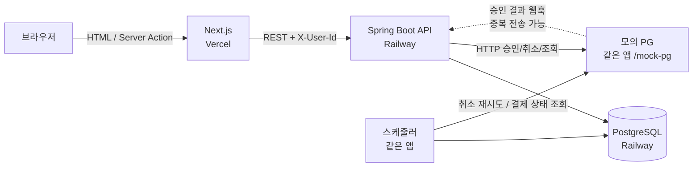
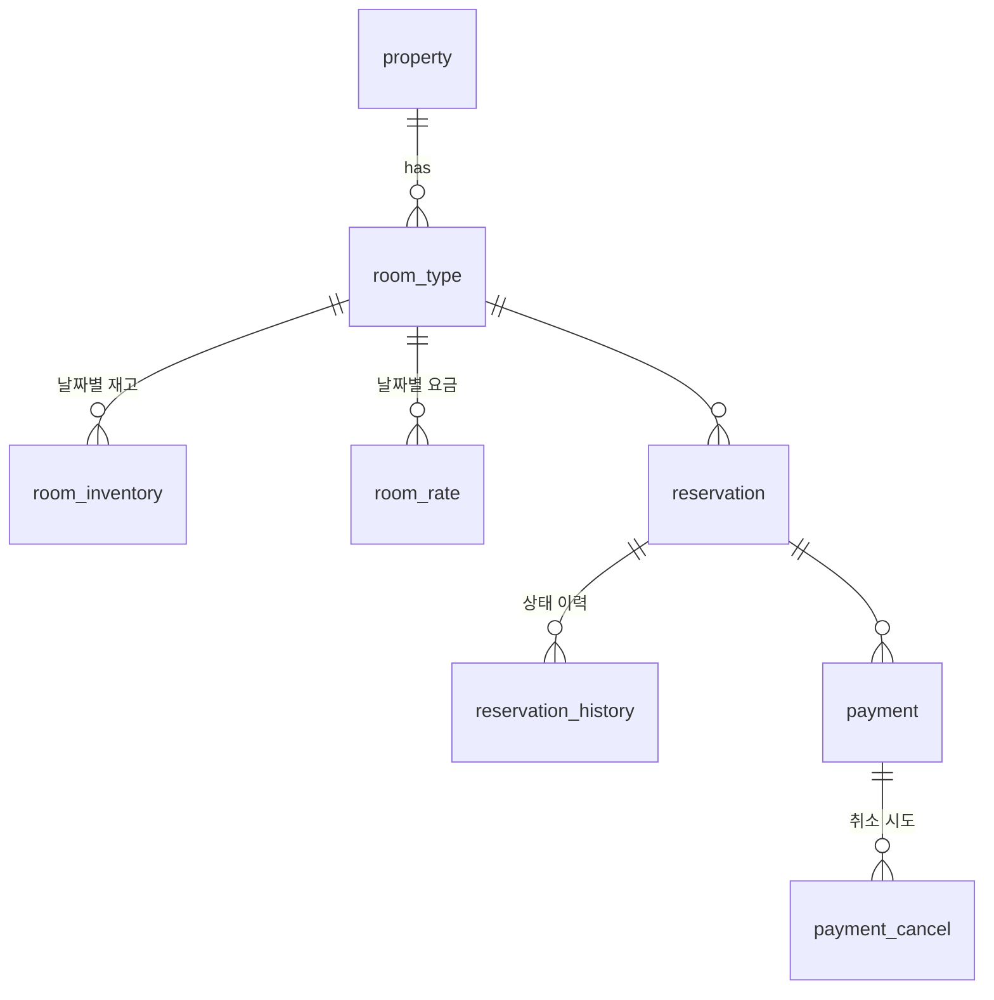
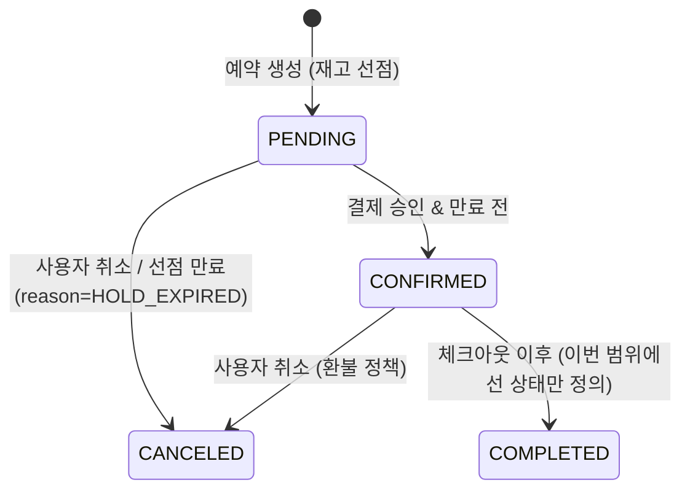
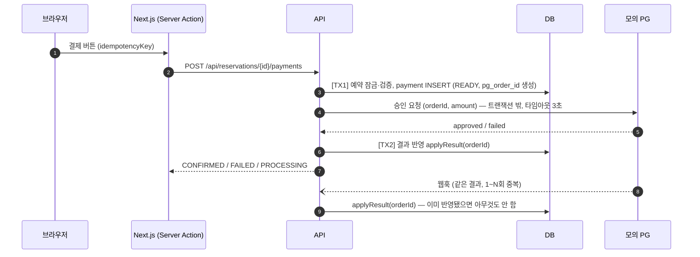

# 02. 설계 — STAYPOINT 호텔 예약 서비스

> 기반: `01-planning.md` (FR / NFR / 정책 / 시나리오 S1~S11)
> 이 문서는 **어떻게** 만들지 정한다. 각 결정에는 이유·버린 대안·깨지는 조건을 함께 적는다 (README Q1·Q2·Q4·Q5·Q6 의 원본).
> 지원자는 Spring Boot 외 대부분이 처음이므로, 처음 쓰는 개념은 **부록 A** 에 짧게 설명한다.

---

## 1. 기술 선택

### 1.1 확정 스택

| 영역 | 선택 | 이유 | 버린 대안 |
|---|---|---|---|
| 프론트 | **Next.js 15 (App Router) + TypeScript** | 과제 고정. App Router 는 서버/클라이언트 경계를 컴포넌트 단위로 정할 수 있어 Q5 를 설명하기 좋음. 15 는 자료가 가장 많고 `fetch` 기본값이 "캐시 안 함" 이라 실시간 재고에 안전 | Pages Router — 구버전 방식, 신규 학습 가치 낮음 / Next 16 — 캐싱 모델(`use cache`)이 새로 바뀌어 자료가 적음 |
| 데이터 패칭 | **서버 컴포넌트 `fetch` + Server Actions** (별도 라이브러리 없음) | 조회는 서버에서, 변경은 Server Action 이 서버에서 백엔드 호출 → **CORS 불필요, 백엔드 주소·사용자 헤더가 브라우저에 노출되지 않음** | TanStack Query / SWR — 클라이언트 캐시가 하나 더 생겨 설명할 것이 늘어남. 이 과제엔 불필요 |
| 스타일 | 기본 CSS (`globals.css`) | UI 는 평가 대상 아님 | Tailwind, 컴포넌트 라이브러리 — 학습 비용 대비 효과 없음 |
| 백엔드 | **Java 17 + Spring Boot 3.5.x + Gradle (Groovy)** | 과제 고정 + **지원자가 유일하게 써본 기술**. Java 17 은 이미 설치된 LTS 이고 Boot 3 의 최소 버전 | Java 21 — 가상 스레드 등 이점을 이 과제에서 쓰지 않음 / Boot 4 — 출시 초기라 자료 부족 / Kotlin — 학습 부담 |
| DB 접근 | **Spring Data JPA + 재고 차감만 네이티브 쿼리** | 일반 CRUD 는 JPA 로 빠르게. 동시성 핵심인 재고 차감은 **SQL 한 줄을 눈으로 보이게** 직접 작성 → 인터뷰에서 설명 가능 | MyBatis — 모든 SQL 직접 작성, 코드량 증가 / JdbcTemplate — 매핑 반복 코드 많음 |
| DB | **PostgreSQL 15** | 과제 권장(ZIVO 운영 버전). 행 잠금·CHECK·부분 UNIQUE 인덱스·`SKIP LOCKED` 등 이 설계에 필요한 기능 제공 | MySQL — 부분 인덱스 미지원 |
| 마이그레이션 | **Flyway** (`db/migration/*.sql`) | 순수 SQL 파일이라 DDL 이 그대로 보임. Spring Boot 기본 통합 | Liquibase — XML/YAML 문법 추가 학습 |
| 테스트 | JUnit 5 + **Testcontainers (PostgreSQL 15)** | 동시성 테스트는 **운영과 같은 DB 엔진**에서 돌려야 의미 있음 (NFR-6) | H2 — 락·제약 동작이 PostgreSQL 과 다름 / embedded-postgres — Docker 를 쓰기로 해서 불필요 |
| 로컬 실행 | **Docker Desktop + docker compose** | DB 를 명령 한 줄로 띄움, 평가자 재현이 가장 쉬움 | PostgreSQL 직접 설치 — 환경마다 다름 |
| 배포 | **Railway (백엔드 + PostgreSQL) + Vercel (프론트)** | Railway 는 같은 프로젝트에서 DB 연결 변수를 백엔드에 바로 참조 → 설정이 가장 단순. Vercel 은 Next.js 제작사 | Render + Neon — 무료 유지엔 더 안정적이나 연동 설정이 늘어남 (L014) |
| API 문서 | springdoc-openapi (Swagger UI) | 과제 권장(OpenAPI 자동 생성), 의존성 1개 | 수동 문서 |
| 헬스 체크 | Spring Boot Actuator `/actuator/health` | 배포 확인·관측성 가산점, 의존성 1개 | — |

**의도적으로 넣지 않는 것**: Lombok(코드가 숨겨져 설명이 어려움 → Java `record` 사용), Redis·메시지 큐(단일 DB 로 충분), 상태관리 라이브러리, 인증 라이브러리.

### 1.2 배포 리스크와 대비 (L014)

- Railway 무료 크레딧(체험 $5 / 30일)이 평가 기간 중 소진될 수 있음 → **2차 인터뷰 전 잔여 크레딧 확인**, 소진 임박 시 Render+Neon 으로 이전 (Dockerfile 이 같으므로 이전 비용 작음).
- Railway PostgreSQL 기본 버전이 15 가 아닐 수 있음 → 배포 시 확인하고 README 에 기록 (사용 기능은 15 이상 공통).

---

## 2. 아키텍처



- **모의 PG 는 같은 Spring 앱 안의 별도 패키지**지만 반드시 **HTTP 로 호출**한다 (`http://localhost:${port}/mock-pg`). 같은 프로세스여도 네트워크 지연·타임아웃·실패가 실제처럼 발생하게 하기 위함. 모의 PG 는 자기 테이블(`mockpg_*`)만 사용한다.
- **스케줄러**(`@Scheduled`)는 세 가지: 선점 만료 해제, 결제 취소 재시도, 응답 못 받은 결제 상태 확정.
- 단일 인스턴스를 가정한다. 여러 인스턴스여도 깨지지 않도록 스케줄러는 `FOR UPDATE SKIP LOCKED` 로 작업을 나눠 가진다.

### 2.1 백엔드 패키지 구조

```
backend/src/main/java/com/staypoint/
├── common/        # 에러 응답, Clock 설정, 공통 예외
├── property/      # 숙소·객실 타입 조회, 가용 객실 검색
├── inventory/     # 날짜별 재고·요금 (재고 차감 네이티브 쿼리가 여기)
├── reservation/   # 예약 생성·조회·취소, 상태 전이, 선점 만료 스케줄러
├── payment/       # 결제 요청, 승인 결과 반영(웹훅), 취소 재시도·상태 확정 스케줄러, PG 클라이언트
├── mockpg/        # 모의 PG (컨트롤러 + 자체 테이블). payment 패키지와 코드 의존 없음
└── admin/         # 관리자 API
```

계층: `Controller`(입출력·검증) → `Service`(트랜잭션 경계 `@Transactional`) → `Repository`(JPA / 네이티브 쿼리). DTO 는 `record`.

---

## 3. 데이터 모델

### 3.1 ERD



### 3.2 테이블

| 테이블 | 주요 컬럼 | 제약 · 인덱스 | 비고 |
|---|---|---|---|
| `property` | id, name, address, region, description, created_at | | |
| `room_type` | id, property_id, name, capacity, default_total_rooms, created_at | FK property | |
| `room_inventory` | id, room_type_id, stay_date, total_count, booked_count, updated_at | **UNIQUE(room_type_id, stay_date)**, **CHECK(0 ≤ booked_count ≤ total_count)** | **동시성의 중심** |
| `room_rate` | id, room_type_id, stay_date, price `NUMERIC(12,0)`, currency `'KRW'` | UNIQUE(room_type_id, stay_date), CHECK(price ≥ 0) | 날짜별 요금 → 주말·성수기 |
| `reservation` | id, reservation_no, user_id, room_type_id, check_in, check_out, guest_count, guest_name, guest_phone, total_amount, status, hold_expires_at, confirmed_at, canceled_at, cancel_reason, refund_amount, idempotency_key, created_at, updated_at | UNIQUE(reservation_no), **UNIQUE(user_id, idempotency_key)**, CHECK(check_out > check_in), INDEX(status, hold_expires_at), INDEX(user_id), INDEX(check_in) | status: PENDING / CONFIRMED / COMPLETED / CANCELED |
| `reservation_history` | id, reservation_id, from_status, to_status, reason, actor, created_at | INDEX(reservation_id) | 모든 상태 전이 기록 |
| `payment` | id, reservation_id, pg_order_id, pg_tid, amount, canceled_amount, status, idempotency_key, fail_reason, approved_at, created_at, updated_at | **UNIQUE(idempotency_key)**, **UNIQUE(pg_order_id)**, UNIQUE(pg_tid), **부분 UNIQUE(reservation_id) WHERE status IN ('READY','APPROVED')** | status: READY / APPROVED / FAILED / CANCELED |
| `payment_cancel` | id, payment_id, cancel_amount, reason, status, cancel_key, attempt_count, last_error, next_retry_at, created_at, updated_at | **UNIQUE(cancel_key)**, INDEX(status, next_retry_at) | reason: USER_CANCEL / COMPENSATION, status: PENDING / SUCCEEDED / MANUAL_REVIEW |
| `mockpg_payment` | id, order_id, tid, amount, canceled_amount, status, created_at | UNIQUE(order_id), UNIQUE(tid) | 모의 PG 전용 |
| `mockpg_cancel` | id, cancel_key, tid, amount, created_at | UNIQUE(cancel_key) | 모의 PG 취소 멱등 |

**설계 포인트 (부록 A 힌트의 질문에 대한 답)**

- **booked_count 카운터 vs 매번 예약 집계**: 카운터를 택함. 차감과 검사를 **한 행의 원자적 UPDATE** 로 끝낼 수 있음. 집계 방식은 "집계 → 판단 → 삽입" 사이에 다른 트랜잭션이 끼어들 수 있어 결국 별도 락이 필요. 대신 카운터는 예약 테이블과 **어긋날 수 있음** → 정합 점검 쿼리(6장)로 보완.
- **UNIQUE(room_type_id, stay_date) 만으로 초과예약이 막히나?** 막히지 않음. 행 중복만 막을 뿐 `booked_count` 증가는 막지 못함 → **조건부 UPDATE + CHECK 제약**을 더함.
- **1박 2일 = 재고 행 1개.** 체크아웃 날짜 미포함 (`stay_date >= check_in AND stay_date < check_out`).
- **idempotency_key 는 클라이언트가 만든다** (4.4).
- **reservation 에 total_amount 를 저장**: 요금이 이후 바뀌어도 예약 금액은 고정 (정책 5.5).
- **부분 UNIQUE 인덱스**: 한 예약에 "진행 중이거나 승인된 결제"는 최대 1건 → 서로 다른 키로 연타해도 DB 가 막음. 실패(FAILED) 후 재결제는 허용.

### 3.3 마이그레이션 · 시드

- `db/migration/V1__init_schema.sql` … 스키마의 단일 출처. 적용된 파일은 수정하지 않음.
- `db/seed/R__demo_data.sql` (Flyway repeatable): 숙소 3개 · 객실 타입 6개 · **오늘부터 90일치** 재고/요금 (`generate_series`, 금·토 요금 +30%). 로컬·데모 배포에서 `seed` 프로파일로 적용.
- **빌드 방식**: Gradle `processResources` 가 `../db/migration`, `../db/seed` 를 클래스패스 `db/migration`, `db/seed` 로 복사 → 저장소 루트 구조를 유지하면서 jar 에 포함. 따라서 **Docker 빌드 컨텍스트는 저장소 루트**.

---

## 4. 핵심 흐름 설계

### 4.1 초과예약 방지 — 조건부 UPDATE (README Q2)

예약 생성 트랜잭션 안에서 숙박 기간의 모든 날짜를 **SQL 한 문장**으로 차감한다.

```sql
UPDATE room_inventory
   SET booked_count = booked_count + 1, updated_at = now()
 WHERE room_type_id = :roomTypeId
   AND stay_date >= :checkIn AND stay_date < :checkOut
   AND booked_count < total_count;
```

- 영향받은 행 수 == 숙박일 수 → 성공. 하나라도 모자라면(매진 날짜 또는 재고 행 없음) **예외 → 트랜잭션 전체 롤백** (FR-RES-2, S3).
- 동작 원리: PostgreSQL 은 UPDATE 대상 행에 **행 잠금**을 건다. 동시에 같은 날짜를 노리는 두 트랜잭션 중 하나는 기다리고, 앞선 트랜잭션이 커밋되면 **WHERE 조건을 최신 값으로 다시 평가**한다. 마지막 1실이면 두 번째는 `booked_count < total_count` 가 거짓이 되어 0행 → 실패.
- 최종 방어선: `CHECK (booked_count <= total_count)`. 코드에 버그가 있어도 DB 가 초과를 거부.

| 방식 | 판단 | 이유 |
|---|---|---|
| **조건부 UPDATE (선택)** | ✅ | 검사+차감이 한 문장이라 사이에 끼어들 틈이 없음. 재시도 로직 불필요. 쿼리가 짧아 설명 쉬움 |
| 비관적 락 (`SELECT … FOR UPDATE` 후 UPDATE) | 차선 | 정확하지만 2단계(조회→수정)라 잠금 보유 시간이 길고 코드가 늘어남. 같은 효과를 한 문장으로 얻을 수 있음 |
| 낙관적 락 (`@Version`) | ✗ | 마지막 객실처럼 **경합이 심한 곳**에선 대부분 충돌 → 재시도 폭주. 재시도 횟수·백오프 설계까지 필요 |
| DB 유니크 제약 (객실 단위 행) | ✗ | 객실 수만큼 행을 만들어 "빈 슬롯" 을 찾아야 함. 재고 수정(관리자)이 복잡해짐 |
| 분산락 (Redis 등) | ✗ | DB 하나로 충분한데 인프라 추가. 락 만료·DB 와의 이중 관리 문제 |

**이 방식이 깨지는 조건 (인터뷰 대비)**

1. `booked_count` 를 이 쿼리 외의 경로(수동 SQL, 버그)로 바꾸면 예약 테이블과 어긋남 → 6장 정합 점검.
2. 재고 행이 날짜별로 하나여야 함 (UNIQUE 가 보장). DB 를 샤딩하거나 재고를 여러 DB 에 나누면 단일 행 잠금 전제가 깨짐.
3. **극단적 경합** (같은 날짜 1,000 건 동시): 정확성은 유지되지만 같은 행 잠금을 순서대로 기다리므로 지연이 쌓이고, 대기 중 트랜잭션이 **DB 커넥션을 쥐고** 있어 커넥션 풀(기본 10)이 고갈될 수 있음 → 대응: 짧은 트랜잭션 유지, `lock_timeout`·커넥션 획득 타임아웃으로 빠른 실패, 규모가 커지면 앞단 대기열(큐)로 요청 평탄화.
4. 여러 날짜 행의 잠금 순서: 한 문장이 같은 인덱스 순서(stay_date 오름차순)로 행을 처리하므로 일반적으로 교착이 없지만, 실행 계획이 달라지면 이론상 교착 가능 → PostgreSQL 이 교착을 감지해 한쪽을 실패시키므로 **초과예약은 생기지 않고 해당 요청만 실패**.

### 4.2 예약 생성

```
POST /api/reservations   (헤더: X-User-Id, Idempotency-Key)
```

하나의 트랜잭션:
1. 입력 검증 (날짜·인원·정원, FR-RES-5)
2. `reservation` INSERT (status=PENDING, `hold_expires_at = now + 10분`, total_amount = 날짜별 요금 합)
   - `UNIQUE(user_id, idempotency_key)` 위반 → 롤백 후 **기존 예약을 조회해 그대로 반환** (FR-RES-6, 연타)
3. 재고 조건부 UPDATE (4.1). 행 수 부족 → `SOLD_OUT` 예외, 전체 롤백
4. `reservation_history` INSERT (null → PENDING)

요금이 없는 날짜가 있으면 예약 불가 (`RATE_NOT_FOUND`).

### 4.3 상태 전이와 잠금 규칙

- 예약 상태 변경은 **`SELECT … FOR UPDATE` 로 예약 행을 잠근 뒤 엔티티 도메인 메서드**(`confirm()`, `cancel()`, `expire()`)로만 한다. 허용되지 않는 전이는 예외.
- 짧은 트랜잭션이고 외부 호출이 없으므로 비관적 잠금이 단순하고 안전하다.
- **잠금 순서 규칙: 항상 reservation → payment → room_inventory.** 모든 흐름이 같은 순서를 따라 교착을 피한다.



**선점 만료 종료 상태 결정**: 새 상태(`EXPIRED`)를 만들지 않고 **`CANCELED` + `cancel_reason = HOLD_EXPIRED`** 로 한다. 상태 수가 늘면 모든 분기·화면이 늘어남. 사유 컬럼으로 구분 가능.

### 4.4 결제 — 트랜잭션 경계와 멱등성 (README Q4)



**PG 호출은 트랜잭션 밖이다.** TX1 을 커밋한 뒤 호출하고, 결과는 TX2 에서 반영한다. PG 가 느려도 DB 잠금·커넥션을 붙잡지 않는다 (NFR-2).

**applyResult(orderId, 결과) — 웹훅과 동기 응답이 공유하는 단 하나의 반영 경로**

1. 예약 잠금 → payment 잠금 (4.3 순서)
2. payment 가 READY 가 아니면 **즉시 반환** (이미 반영됨 → 중복 통지 무시)
3. 결과가 failed → payment FAILED. 예약은 PENDING 유지 (만료 전 재결제 가능, 정책 5.4)
4. 결과가 approved → payment APPROVED, 그리고
   - 예약이 PENDING 이고 만료 전이고 금액이 같으면 → `confirm()` → CONFIRMED
   - 아니면 (만료됨·이미 취소됨·금액 불일치, FR-PAY-7~9) → **같은 트랜잭션에서 보상 취소 요청(`payment_cancel`, reason=COMPENSATION) 생성** → 커밋 후 취소 실행, 실패 시 재시도(4.6)

**중복 · 재시도별 방어 키**

| 상황 | 막는 키 | 위치 |
|---|---|---|
| 예약 버튼 연타 | `Idempotency-Key` (클라이언트 UUID) | `reservation UNIQUE(user_id, idempotency_key)` |
| 결제 버튼 연타 / 같은 요청 재전송 | `Idempotency-Key` (결제 화면 진입 시 클라이언트 생성, 재시도에 재사용) | `payment UNIQUE(idempotency_key)` → 기존 결제 결과 반환 |
| 다른 키로 동시 결제 시도 | 예약당 진행 중·승인 결제 1건 | `payment 부분 UNIQUE(reservation_id) WHERE status IN (READY, APPROVED)` |
| 승인 웹훅 중복 | `pg_order_id` + payment 상태 | applyResult 2단계 (READY 아니면 무시) |
| PG 승인 요청 재전송 | `orderId` | 모의 PG `mockpg_payment UNIQUE(order_id)` → 같은 orderId 는 기존 결과 반환 (이중 승인 없음) |
| PG 취소 재시도 | `cancel_key` | `payment_cancel UNIQUE(cancel_key)`, `mockpg_cancel UNIQUE(cancel_key)` → 이미 처리된 취소는 성공으로 응답 |

**Idempotency key 는 누가 만드나?** 클라이언트. "같은 의도의 재요청" 인지는 요청을 보낸 쪽만 알 수 있기 때문. 서버가 만들면 재전송마다 새 키가 생겨 중복을 구분할 수 없다. 서버는 키의 유일성만 DB 로 보장한다.

**타임아웃 — 승인됐는데 응답을 못 받은 경우**

- payment 는 READY 로 남고 클라이언트에는 `PROCESSING` 응답 → 화면이 예약 상태를 다시 조회.
- 확정 경로 2개: ① 모의 PG 웹훅이 도착하면 applyResult, ② **결제 상태 확정 스케줄러**가 1분 이상 READY 인 결제를 모의 PG 조회 API(`GET /mock-pg/payments/{orderId}`)로 확인해 applyResult (PG 에 기록이 없으면 FAILED).
- 어느 쪽이 먼저 와도 applyResult 가 멱등이라 결과는 한 번만 반영된다.

### 4.5 취소 · 환불

```
POST /api/reservations/{id}/cancel   (헤더: X-User-Id)
```

하나의 트랜잭션:
1. 예약 잠금, 소유자 확인 (FR-CAN-7)
2. 이미 CANCELED → **저장된 결과(refund_amount, canceled_at)를 그대로 반환** (멱등 성공, 정책 5.3). COMPLETED → 거부
3. 환불액 계산 `RefundPolicy.calculate(totalAmount, checkIn, today(Asia/Seoul))` — 순수 함수, Clock 주입
4. `cancel()` → CANCELED, refund_amount 저장, history 기록
5. 재고 복원: `UPDATE room_inventory SET booked_count = booked_count - 1 WHERE … stay_date 구간` (CHECK 가 음수 방지)
6. 승인된 결제가 있고 환불액 > 0 → `payment_cancel` (USER_CANCEL, PENDING) INSERT

커밋 후 즉시 PG 취소 1회 시도 (트랜잭션 밖). 실패해도 사용자 응답은 성공 — 취소 요청은 저장돼 있고 재시도가 처리한다.

**RefundPolicy** (정책 5.2): `D = checkIn − today` → D≥7: 100%, D≥3: 70%, D≥1: 50%, 그 외 0%. 금액 = `floor(total × rate)` (원 단위 내림). 정책 표는 이 클래스 한 곳에만.

### 4.6 결제 취소 재시도 (R4)

- `payment_cancel` 테이블 자체가 **작업 큐(아웃박스)** 역할.
- 스케줄러(10초 주기):
  ```sql
  SELECT * FROM payment_cancel
   WHERE status = 'PENDING' AND next_retry_at <= now()
   ORDER BY next_retry_at LIMIT 10
   FOR UPDATE SKIP LOCKED;
  ```
  `SKIP LOCKED` — 다른 인스턴스/스레드가 잡은 행은 건너뜀 → 같은 취소를 동시에 두 번 실행하지 않음.
- 각 건마다 모의 PG 취소 호출(`cancel_key` 전달):
  - 성공 → SUCCEEDED, payment.canceled_amount 증가, 전액이면 payment CANCELED
  - 실패(타임아웃·5xx) → attempt_count+1, last_error 기록, `next_retry_at = now + 1분 × 2^(attempt−1)` (1·2·4·8분)
  - **attempt_count ≥ 5 → MANUAL_REVIEW** (무한 재시도 금지) → 관리자 "확인 필요" 목록에 노출, 수동 재시도 버튼 제공
- PG 호출은 행 잠금을 쥔 채 하지 않는다: ① 짧은 트랜잭션으로 대상 행을 "처리 중" 표시(next_retry_at 을 미래로 미룸) 후 커밋 → ② PG 호출 → ③ 결과 반영 트랜잭션. 중간에 서버가 죽어도 미뤄둔 시각이 지나면 다시 집어감 (cancel_key 로 중복 안전).

**"5번 실패하면 그 돈은 어떻게 되나?"** → 고객 돈은 PG 에 승인 상태로 남아 있고 시스템에는 MANUAL_REVIEW 로 기록됨. 운영자가 관리자 화면에서 확인 후 수동 재시도하거나 PG 관리 콘솔에서 직접 취소 → 결과를 기록. 돈이 "사라지는" 경로는 없고 "운영자가 반드시 보게 되는" 경로만 있다.

### 4.7 선점 만료

- 스케줄러(30초 주기): `status = PENDING AND hold_expires_at <= now` 인 예약을 `SKIP LOCKED` 로 가져와 건별 트랜잭션에서 `expire()` → CANCELED(HOLD_EXPIRED) + 재고 복원.
- **만료와 결제 승인이 동시에 오면?** 둘 다 예약 행을 잠그고 시작하므로 **순서가 강제**된다.
  - 만료가 먼저 → 승인 반영 시 예약이 PENDING 이 아님 → 보상 취소 (S7)
  - 승인이 먼저 → CONFIRMED → 만료 스케줄러의 조건(PENDING)에 걸리지 않음
- 결제 요청 시 남은 선점 시간이 30초 미만이면 결제를 거부해 "결제 직후 만료" 경합을 줄인다 (정확성은 위 잠금이 보장, 이건 사용자 경험 개선).

---

## 5. 모의 PG

| API | 동작 |
|---|---|
| `POST /mock-pg/payments/approve` `{orderId, amount}` | `approved` + tid 또는 `failed` 반환. 같은 orderId 재요청 → 처음 결과 그대로 |
| `GET /mock-pg/payments/{orderId}` | 승인 기록 조회 (타임아웃 후 상태 확정용) |
| `POST /mock-pg/payments/{tid}/cancel` `{cancelKey, amount}` | 전액/부분 취소. 잔여 승인액 초과 시 거부. 같은 cancelKey → 이전 결과 |

**장애 주입** (설정 기본값 + 요청 쿼리 파라미터로 덮어쓰기, FR-PAY-2):

| 설정 | 의미 | 기본 |
|---|---|---|
| `mockpg.approve.fail-rate` / `?failRate=` | 승인 실패 확률 (0~1) | 0.1 |
| `mockpg.approve.delay-ms` / `?delayMs=` | 응답 지연 | 300 |
| `mockpg.cancel.fail-rate` | 취소 5xx 확률 | 0.0 |
| `mockpg.webhook.enabled` / `duplicate-count` | 승인 후 웹훅 전송 여부·**중복 전송 횟수** | true / 2 |

- 웹훅: 승인 처리 후 비동기로 `POST /api/payments/webhook` 을 `duplicate-count` 번 호출 → 중복 처리 방어를 데모로 보여줌.
- 웹훅 요청에는 공유 비밀값 헤더(`X-Mock-PG-Secret`, 환경변수)를 붙이고 API 가 검증한다.
- 프론트 결제 화면에서 실패율·지연을 선택해 시나리오를 재현할 수 있게 한다 (데모용).

---

## 6. 재고 정합성 점검 (README Q6)

"정답" 은 **예약 테이블**이다 (각 예약이 어떤 날짜를 쓰는지 근거가 남아 있음). `booked_count` 는 빠른 검사를 위한 파생값.

```sql
-- 날짜별 기대 사용량 = 활성 예약(PENDING 이면서 미만료, CONFIRMED, COMPLETED) 수
SELECT i.room_type_id, i.stay_date, i.booked_count, COUNT(r.id) AS expected
  FROM room_inventory i
  LEFT JOIN reservation r
    ON r.room_type_id = i.room_type_id
   AND i.stay_date >= r.check_in AND i.stay_date < r.check_out
   AND r.status IN ('PENDING','CONFIRMED','COMPLETED')
 GROUP BY i.id
HAVING i.booked_count <> COUNT(r.id);
```

- 감지: 관리자 API `GET /api/admin/inventory/mismatches` 로 위 쿼리 결과 제공 (+ 시간이 남으면 주기 실행 후 로그 경보).
- 복구: 운영자가 확인 후 `booked_count` 를 기대값으로 보정 (자동 보정은 하지 않음 — 원인 파악 전 덮어쓰면 버그를 숨김).
- 만료 직전(PENDING 이지만 만료 시각 경과, 스케줄러 미처리) 행은 일시적 불일치로 보일 수 있음 → 쿼리에서 만료 시각 경과분은 제외하거나 표시.

---

## 7. API 명세

공통: JSON, 사용자 식별 `X-User-Id` 헤더, 에러 형식 `{ "code": "SOLD_OUT", "message": "...", "details": {...} }`.
상세 스키마는 springdoc 이 생성(`/swagger-ui.html`).

### 사용자

| 메서드 | 경로 | 설명 | FR |
|---|---|---|---|
| GET | `/api/properties?region=` | 숙소 목록 | SRCH-1 |
| GET | `/api/properties/{id}` | 숙소 상세 + 객실 타입 | SRCH-1 |
| GET | `/api/properties/{id}/availability?checkIn&checkOut&guests` | 예약 가능 객실 + 날짜별 요금 + 총액 | SRCH-2~4 |
| POST | `/api/reservations` | 예약 생성 (`Idempotency-Key`) | RES-1~6 |
| GET | `/api/reservations/me` | 내 예약 목록 | UI-2 |
| GET | `/api/reservations/{id}` | 상세 + 환불 예정액 (지금 취소 시) | UI-2 |
| POST | `/api/reservations/{id}/payments` | 결제 요청 (`Idempotency-Key`, 데모용 `failRate`·`delayMs`) | PAY-1~9 |
| POST | `/api/reservations/{id}/cancel` | 취소 (멱등) | CAN-1~7 |
| POST | `/api/payments/webhook` | 모의 PG 승인 통지 | PAY-5 |

### 관리자

| 메서드 | 경로 | 설명 | FR |
|---|---|---|---|
| GET | `/api/admin/reservations?status&propertyId&from&to&page&size` | 예약 목록 (필터·페이지네이션) | UI-3 |
| GET | `/api/admin/room-types/{id}/calendar?from&to` | 날짜별 재고·요금 | UI-4 |
| PUT | `/api/admin/room-types/{id}/inventory` `{from, to, totalCount}` | 기간 재고 설정 (booked 미만 거부) | UI-4 |
| PUT | `/api/admin/room-types/{id}/rates` `{from, to, price}` | 기간 요금 설정 | UI-4 |
| GET | `/api/admin/payment-cancels?status=MANUAL_REVIEW` | 운영자 확인 대상 | UI-5, RTY-3 |
| POST | `/api/admin/payment-cancels/{id}/retry` | 수동 재시도 | RTY-3 |
| GET | `/api/admin/inventory/mismatches` | 재고 정합 점검 | Q6 |

### 주요 에러 코드

`VALIDATION_FAILED`, `SOLD_OUT`, `RATE_NOT_FOUND`, `HOLD_EXPIRED`, `INVALID_STATE`, `NOT_OWNER`, `PAYMENT_IN_PROGRESS`, `INVENTORY_BELOW_BOOKED`, `NOT_FOUND`

---

## 8. 프론트엔드 설계 (README Q5)

### 8.1 라우트

| 경로 | 렌더링 | 데이터 | 캐시 |
|---|---|---|---|
| `/` | 서버 | 숙소 목록 + 검색 폼 | `revalidate: 60` (숙소 정보는 거의 안 바뀜) |
| `/properties/[id]?checkIn&checkOut&guests` | 서버 | 숙소 상세 + **가용 객실** | **`no-store`** (재고는 초 단위로 변함) |
| `/reservations/new?roomTypeId&…` | 서버 + 폼 | 예약 정보 입력 → Server Action | — |
| `/reservations/[id]/pay` | 서버 + **클라이언트(결제 버튼)** | 예약 요약, 결제 실행 | `no-store` |
| `/me/reservations`, `/me/reservations/[id]` | 서버 + 클라이언트(취소 버튼) | 내 예약, 환불 예정액 | `no-store` |
| `/admin/reservations` | 서버 | 필터는 URL `searchParams` → 서버에서 조회 | `no-store` |
| `/admin/inventory` | 서버 + 폼 | 재고·요금 달력, 기간 일괄 수정 | `no-store` |
| `/admin/issues` | 서버 | MANUAL_REVIEW 목록, 재고 불일치 | `no-store` |

### 8.2 서버 / 클라이언트 경계

- **기본은 서버 컴포넌트**: 데이터를 서버에서 가져와 HTML 로 보냄. 백엔드 주소(`BACKEND_URL`)와 `X-User-Id` 는 서버에서만 다룸.
- **클라이언트 컴포넌트는 상호작용이 필요한 곳만**: 결제 버튼(연타 방지·진행 상태·멱등 키 유지), 취소 확인 버튼, 날짜 입력 보조.
- **변경은 Server Action**: 폼 제출 → Next 서버에서 백엔드 호출 → `revalidatePath` 로 관련 페이지 갱신. 브라우저가 백엔드를 직접 부르지 않으므로 CORS 설정 불필요.
- **실시간 재고 캐싱**: 가용 객실·예약 상태는 캐시하지 않는다(`no-store`). 화면에 보인 재고는 "참고값" 이고, **최종 판단은 예약 생성 시 DB 의 조건부 UPDATE** 가 한다 — 화면을 본 뒤 매진되면 `SOLD_OUT` 메시지를 보여줌. 캐시를 짧게 둬도 정확성은 깨지지 않지만, 매진된 객실을 보여주는 빈도가 늘어 굳이 캐시하지 않음.
- **사용자 식별**: 상단에 사용자 ID 입력란 → 쿠키(`uid`) 저장 → 서버가 읽어 `X-User-Id` 로 전달. 관리자 화면은 인증 없음 (과제 명시).
- **결제 멱등 키**: 결제 화면에서 `crypto.randomUUID()` 로 만들어 `sessionStorage` 에 예약별로 보관 → 새로고침·재클릭에도 같은 키 재사용.

---

## 9. 설정 · 환경변수

| 키 | 위치 | 설명 |
|---|---|---|
| `SPRING_DATASOURCE_URL` / `USERNAME` / `PASSWORD` | backend | 로컬은 compose 값, Railway 는 Postgres 서비스 참조 변수로 구성 |
| `SPRING_PROFILES_ACTIVE` | backend | `local` / `prod`, 데모 데이터는 `seed` 추가 |
| `staypoint.hold-minutes` | backend | 선점 만료 (기본 10) |
| `staypoint.cancel-retry.max-attempts` | backend | 취소 최대 시도 (기본 5) |
| `mockpg.*` | backend | 5장 장애 주입 설정 |
| `MOCKPG_WEBHOOK_SECRET` | backend | 웹훅 공유 비밀 (커밋 금지) |
| `BACKEND_URL` | frontend | 서버에서만 사용 (`NEXT_PUBLIC_` 아님 → 브라우저 노출 없음) |

- 시크릿은 `.env` / 플랫폼 환경변수로만. 저장소에는 `.env.example` 만.
- 시간: `Clock` 빈 (Asia/Seoul) 주입, DB 는 `timestamptz`. 테스트는 고정 Clock.
- JVM 메모리: Railway 컨테이너에 맞춰 `-XX:MaxRAMPercentage=75`.

---

## 10. 테스트 전략

| 테스트 | 종류 | 검증 내용 | 시나리오 |
|---|---|---|---|
| **동시 예약** | 통합 (Testcontainers) | 재고 K=3 에 N=50 스레드 동시 예약 → 성공 정확히 3, `booked_count == 3`, 나머지 SOLD_OUT | S2 |
| 다박 부분 매진 | 통합 | 3박 중 1일 매진 → 실패, 다른 날짜 booked 불변 | S3 |
| 예약 연타 | 통합 | 같은 Idempotency-Key 동시 2회 → 예약 1건 | FR-RES-6 |
| **환불 계산** | 단위 | D = 8, 7, 6, 3, 2, 1, 0, −1 → 100/100/70/70/50/50/0/0%, 내림 확인 | S10 |
| 웹훅 중복 | 통합 | 같은 승인 통지 동시 3회 → payment APPROVED 1건, history CONFIRMED 1건 | S5 |
| 결제 연타 | 통합 | 다른 키로 동시 결제 2회 → 진행 결제 1건 | S6 |
| 만료 후 결제 요청 | 통합 | 선점 만료 처리된 예약에 결제 요청 → `HOLD_EXPIRED` 거부, 재고 복원 확인 | S4 |
| 만료 후 승인 | 통합 | 만료 처리 후 승인 반영 → CONFIRMED 안 됨, 보상 취소 생성 | S7 |
| 취소 재시도 한도 | 통합 | PG 취소 실패율 100% → 5회 후 MANUAL_REVIEW, 6회째 호출 없음 | S8 |
| 재취소 | 통합 | CANCELED 재취소 → 같은 결과, 재고·환불 1회 | S9 |
| 상태 전이 | 단위 | 허용되지 않는 전이 예외 | — |

- 동시성 테스트는 `ExecutorService` + `CountDownLatch` 로 **동시에 출발**시킨다. 실행 결과를 README Q3 에 붙인다.
- 필수 2개(동시 예약, 환불 계산)는 T04·T08 에서 반드시 작성. 나머지는 해당 Task 완료 조건에 포함하되 시간이 부족하면 README 에 명시.

---

## 11. 배포 설계

| 대상 | 플랫폼 | 방식 |
|---|---|---|
| DB | Railway PostgreSQL | 같은 Railway 프로젝트에 추가 |
| 백엔드 | Railway | `backend/Dockerfile` (멀티 스테이지: Gradle 빌드 → JRE 17), **빌드 컨텍스트 = 저장소 루트** (db/ 포함 위해). DB 접속 정보는 Railway 참조 변수로 주입. 헬스 체크 `/actuator/health` |
| 프론트 | Vercel | Root Directory = `frontend`, 환경변수 `BACKEND_URL` = Railway 백엔드 공개 URL |

- 배포 중 막힌 지점은 즉시 `worklog.html` 에 error 로 기록 → README "배포하며 막혔던 지점" 의 원본.
- 자동 배포: Railway·Vercel 모두 GitHub 연동 시 push 마다 배포 (가산점). 단 **push 는 사용자 요청 시에만** 하므로 배포 시점도 사용자가 정한다.

---

## 12. Task 목록 (개발 ⇄ 리뷰)

우선순위는 FAQ 순서(예약 → 결제 → 취소 → 조회 → 화면 → 재시도)를 따르되, 의존성 때문에 기반·시드를 먼저 둔다.
각 Task 는 AGENT.md 13장 절차(브랜치 → 개발 → 검증 → 커밋 → 리뷰 → 로컬 병합)를 따른다.

| ID | Task | 범위 | 완료 조건 | 인터뷰 대비 포인트 |
|---|---|---|---|---|
| **T03** | 백엔드 기반 | Spring Boot 프로젝트, docker compose(PG15), Flyway V1 전체 스키마, 시드, Testcontainers 설정, Actuator, 공통 에러 형식, Clock | `./gradlew build` 통과, 빈 DB 에 마이그레이션 적용, 헬스 체크 200 | Flyway 동작, 테이블 제약이 왜 있는지 |
| **T04** | 예약 생성 · 재고 선점 | 4.1·4.2, 예약 멱등, history | **동시 예약 테스트 통과**(S2), S3, 연타 테스트 | 조건부 UPDATE 원리, 행 잠금, 깨지는 조건 |
| **T05** | 선점 만료 | 4.7 스케줄러, 결제 전 잔여 시간 검사 | 만료 → CANCELED(HOLD_EXPIRED) + 재고 복원 테스트, 만료 예약 결제 거부(S4) | SKIP LOCKED, 만료·결제 경합 순서 |
| **T06** | 모의 PG | 5장 API 3개, 장애 주입, 웹훅 중복 전송, orderId·cancelKey 멱등 | 실패율·지연 설정 동작, 같은 orderId 재승인 시 동일 결과 | 왜 같은 앱인데 HTTP 로 부르는가 |
| **T07** | 결제 · 확정 · 보상 | 4.4 전체, 결제 상태 확정 스케줄러 | S5·S6·S7 테스트 통과 | 트랜잭션 밖 PG 호출, applyResult 멱등, 타임아웃 처리 |
| **T08** | 취소 · 환불 | 4.5, RefundPolicy | **환불 계산 테스트 통과**(S10), S9, 재고 복원 | 환불 경계 해석, 재취소 멱등 |
| **T09** | 조회 API | 숙소 목록·상세, 가용 객실 검색(날짜 전체 재고·요금·정원) | 다박·매진·정원 초과 케이스 테스트 | 가용 검색 쿼리 |
| **T10** | 관리자 API | 예약 목록(필터·페이지네이션), 재고·요금 기간 설정, 확인 대상 목록, 재고 불일치 | booked 미만 재고 거부 테스트(S11) | 정합 점검 쿼리, 무엇이 정답인가 |
| **T11** | 프론트 기반 · 예약 흐름 | Next 프로젝트, 사용자 쿠키, 검색 → 객실 → 예약 → 결제 화면 | `npm run lint`·`build` 통과, 로컬에서 S1 수행 | 서버/클라이언트 경계, Server Action, no-store |
| **T12** | 프론트 내 예약 · 취소 | 목록·상세·환불 예정액·취소 | 취소 후 상태·재고 반영 확인 | revalidatePath |
| **T13** | 프론트 관리자 | 예약 목록 필터·페이지, 재고·요금 수정, 확인 대상 | 필터·페이지 이동 동작 | searchParams 기반 서버 조회 |
| **T14** | 결제 취소 재시도 | 4.6 스케줄러, 백오프, MANUAL_REVIEW, 수동 재시도 | S8 테스트 통과 | 무한 재시도 금지, "그 돈은 어떻게 되나" |
| **T15** | 배포 | Dockerfile, Railway(백엔드+DB), Vercel(프론트) | 배포 URL 에서 S1 수행, 막힌 지점 기록 | 배포 선택 이유, 트래픽 10배 시 |
| **T16** | README · 제출 점검 | 8개 질문 답 정리, 실행 방법 clean clone 검증, 시크릿 이력 점검, 투입 시간 | 부록 B 체크리스트 10개 충족 | 전체 흐름 설명 리허설 |

- **시간 부족 시 축소 순서**: T14 → T13 → T12 일부 → T10 일부. T04·T07·T08 과 필수 테스트, README 는 축소 대상 아님.
- T14 의 `payment_cancel` 생성은 T07·T08 에서 이미 하므로, T14 를 못 해도 **취소 요청은 기록되고 운영자가 볼 수 있다** (요구사항의 최소 조건 충족).
- 배포는 처음이라 막힐 수 있으므로, 시간이 허락하면 T07 이후 백엔드만 먼저 Railway 에 올려보는 것을 고려한다.

---

## 13. README 반영 초안 매핑

| README 질문 | 원본 |
|---|---|
| Q1 기술 선택 | 1장 (+ 작업 로그 decision 항목) |
| Q2 초과예약 방지 | 4.1 |
| Q3 증명 | 10장 동시 예약 테스트 실행 결과 (T04 에서 생성) |
| Q4 트랜잭션·멱등 | 4.4, 4.5, 4.6 |
| Q5 프론트 경계·캐싱 | 8장 |
| Q6 재고 불일치 | 6장 |
| Q7 처음 써본 것 | Spring Boot 외 전부 처음 (Next.js, JPA 심화, PostgreSQL, Flyway, Docker, Testcontainers, Railway, Vercel). Task 마다 익힌 방법·시간을 작업 로그에 기록 |
| Q8 더 했다면 | 축소된 Task, 가산점 후보 (기획 8장) |

---

## 부록 A. 처음 쓰는 개념 요약

| 개념 | 한 줄 설명 | 이 프로젝트에서 |
|---|---|---|
| 트랜잭션 | 여러 SQL 을 "전부 성공 또는 전부 취소" 로 묶는 단위 | 예약 = 예약 INSERT + 재고 UPDATE 를 한 묶음으로 |
| 행 잠금 (row lock) | UPDATE·`FOR UPDATE` 한 행은 커밋 전까지 다른 트랜잭션이 수정 못 하고 기다림 | 같은 날짜 재고를 동시에 못 바꾸게 |
| 조건부 UPDATE | `WHERE` 에 조건을 넣어 조건이 맞을 때만 수정, 영향 행 수로 성공 판단 | 재고가 남았을 때만 차감 |
| CHECK 제약 | 컬럼 값이 조건을 어기면 DB 가 저장을 거부 | `booked_count ≤ total_count` 최종 방어 |
| 부분 UNIQUE 인덱스 | 특정 조건의 행들 사이에서만 유일성 보장 | 예약당 진행 중 결제 1건 |
| 멱등성 | 같은 요청을 여러 번 보내도 결과가 한 번 보낸 것과 같음 | 연타·중복 웹훅·재시도 |
| 아웃박스 패턴 | 외부 호출할 일을 DB 테이블에 먼저 기록하고 별도 작업자가 처리 | `payment_cancel` 재시도 큐 |
| `FOR UPDATE SKIP LOCKED` | 잠긴 행은 건너뛰고 나머지만 가져옴 | 스케줄러가 같은 작업을 중복 처리하지 않게 |
| Flyway | 버전 번호가 붙은 SQL 파일을 순서대로 한 번씩 적용 | 빈 DB 에서 스키마 재현 |
| Testcontainers | 테스트 중에 Docker 로 진짜 DB 를 잠깐 띄움 | 동시성 테스트를 실제 PostgreSQL 에서 |
| 서버 컴포넌트 | 서버에서 실행돼 HTML 로 오는 React 컴포넌트, 브라우저에 코드가 안 감 | 조회 화면 대부분 |
| 클라이언트 컴포넌트 | `"use client"` — 브라우저에서 실행, 클릭·상태 처리 | 결제·취소 버튼 |
| Server Action | 폼/버튼이 호출하는 서버 함수. 브라우저가 API 를 직접 안 부름 | 예약 생성, 결제, 취소, 관리자 수정 |
| `revalidatePath` | 변경 후 해당 페이지의 캐시를 버려 새 데이터로 다시 그림 | 취소 후 내 예약 화면 갱신 |
